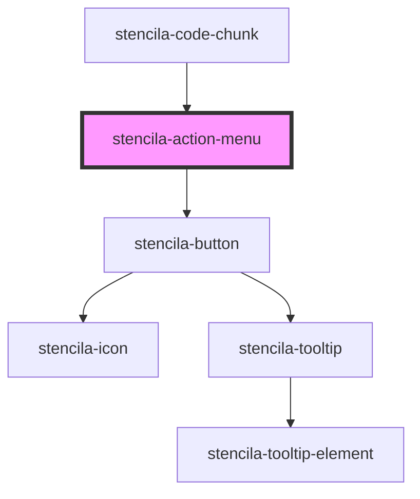

# stencila-action-menu

<!-- Auto Generated Below -->

## Properties

| Property     | Attribute    | Description                                                   | Type                  | Default     |
| ------------ | ------------ | ------------------------------------------------------------- | --------------------- | ----------- |
| `actions`    | --           | List of buttons to include in Action Menu.                    | `HTMLButtonElement[]` | `undefined` |
| `expandable` | `expandable` | Defines whether the Action Menu can be collapsed and expanded | `boolean`             | `false`     |

## CSS Custom Properties

| Name           | Description                                   |
| -------------- | --------------------------------------------- |
| `--background` | Background color of the Action Menu component |
| `--border`     | Border color of the Action Menu component     |

## Dependencies

### Used by

 - [stencila-code-chunk](../codeChunk)

### Depends on

- [stencila-button](../button)

### Graph

----------------------------------------------

*Built with [StencilJS](https://stenciljs.com/)*
