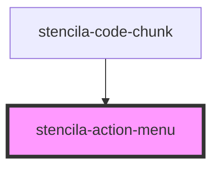

# stencila-actionmenu

<!-- Auto Generated Below -->

## Properties

| Property  | Attribute | Description                                | Type                  | Default     |
| --------- | --------- | ------------------------------------------ | --------------------- | ----------- |
| `actions` | --        | List of buttons to include in Action Menu. | `HTMLButtonElement[]` | `undefined` |

## Dependencies

### Used by

 - [stencila-code-chunk](../codeChunk)

### Graph

----------------------------------------------

*Built with [StencilJS](https://stenciljs.com/)*
