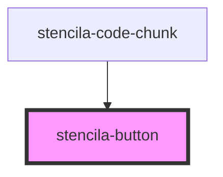

# stencila-button

<!-- Auto Generated Below -->

## Properties

| Property      | Attribute      | Description                                                                                                                                        | Type                                          | Default     |
| ------------- | -------------- | -------------------------------------------------------------------------------------------------------------------------------------------------- | --------------------------------------------- | ----------- |
| `ariaLabel`   | `aria-label`   | Screen-reader accessible label to read out.                                                                                                        | `string`                                      | `undefined` |
| `buttonType`  | `button-type`  | The type of button to render, options correspond to HTML Button `type` attribute. https://developer.mozilla.org/en-US/docs/Web/HTML/Element/button | `"button" \| "reset" \| "submit"`             | `undefined` |
| `disabled`    | `disabled`     | If true, prevents the user from interacting with the button.                                                                                       | `boolean`                                     | `false`     |
| `href`        | `href`         | If an `href` property is provided, button will be rendered using an `<a>` anchor tag.                                                              | `string`                                      | `undefined` |
| `iconName`    | `icon-name`    |                                                                                                                                                    | `string`                                      | `undefined` |
| `isSecondary` | `is-secondary` | The displayed text of the Tab.                                                                                                                     | `boolean`                                     | `false`     |
| `label`       | `label`        | The displayed text of the Button.                                                                                                                  | `string`                                      | `undefined` |
| `size`        | `size`         | The displayed text of the Button.                                                                                                                  | `"default" \| "large" \| "small" \| "xsmall"` | `undefined` |

## Dependencies

### Used by

 - [stencila-code-chunk](../codeChunk)

### Graph

----------------------------------------------

*Built with [StencilJS](https://stenciljs.com/)*
