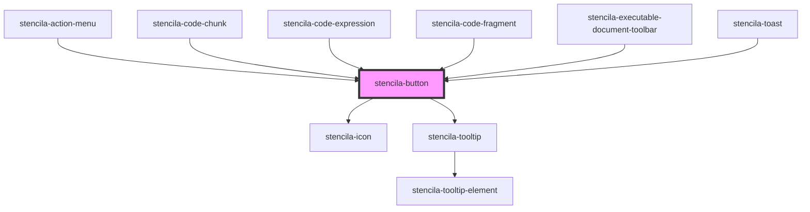

# stencila-button

<!-- Auto Generated Below -->

## Properties

| Property      | Attribute      | Description                                                                                                                                                                                                             | Type                                                                                                                                                                                                                                                                                                                                                                                                                                                                                                                                                                                                                                                                                                                                                                                                                                                                                                                                                                                                                                                                                                                                                                                                                                                                                              | Default     |
| ------------- | -------------- | ----------------------------------------------------------------------------------------------------------------------------------------------------------------------------------------------------------------------- | ------------------------------------------------------------------------------------------------------------------------------------------------------------------------------------------------------------------------------------------------------------------------------------------------------------------------------------------------------------------------------------------------------------------------------------------------------------------------------------------------------------------------------------------------------------------------------------------------------------------------------------------------------------------------------------------------------------------------------------------------------------------------------------------------------------------------------------------------------------------------------------------------------------------------------------------------------------------------------------------------------------------------------------------------------------------------------------------------------------------------------------------------------------------------------------------------------------------------------------------------------------------------------------------------- | ----------- |
| `ariaLabel`   | `aria-label`   | Screen-reader accessible label to read out.                                                                                                                                                                             | `string`                                                                                                                                                                                                                                                                                                                                                                                                                                                                                                                                                                                                                                                                                                                                                                                                                                                                                                                                                                                                                                                                                                                                                                                                                                                                                          | `undefined` |
| `buttonType`  | `button-type`  | The type of button to render, options correspond to HTML Button `type` attribute. https://developer.mozilla.org/en-US/docs/Web/HTML/Element/button Only applies if the button is not an anchor link.                    | `"button" \| "reset" \| "submit"`                                                                                                                                                                                                                                                                                                                                                                                                                                                                                                                                                                                                                                                                                                                                                                                                                                                                                                                                                                                                                                                                                                                                                                                                                                                                 | `undefined` |
| `color`       | `color`        | The color of the button                                                                                                                                                                                                 | `ThemeColorNames \| "brand-50" \| "brand-100" \| "brand-200" \| "brand-300" \| "brand-400" \| "brand-500" \| "brand-600" \| "brand-700" \| "brand-800" \| "brand-900" \| "danger-50" \| "danger-100" \| "danger-200" \| "danger-300" \| "danger-400" \| "danger-500" \| "danger-600" \| "danger-700" \| "danger-800" \| "danger-900" \| "key-50" \| "key-100" \| "key-200" \| "key-300" \| "key-400" \| "key-500" \| "key-600" \| "key-700" \| "key-800" \| "key-900" \| "neutral-50" \| "neutral-100" \| "neutral-200" \| "neutral-300" \| "neutral-400" \| "neutral-500" \| "neutral-600" \| "neutral-700" \| "neutral-800" \| "neutral-900" \| "primary-50" \| "primary-100" \| "primary-200" \| "primary-300" \| "primary-400" \| "primary-500" \| "primary-600" \| "primary-700" \| "primary-800" \| "primary-900" \| "stock-50" \| "stock-100" \| "stock-200" \| "stock-300" \| "stock-400" \| "stock-500" \| "stock-600" \| "stock-700" \| "stock-800" \| "stock-900" \| "success-50" \| "success-100" \| "success-200" \| "success-300" \| "success-400" \| "success-500" \| "success-600" \| "success-700" \| "success-800" \| "success-900" \| "warn-50" \| "warn-100" \| "warn-200" \| "warn-300" \| "warn-400" \| "warn-500" \| "warn-600" \| "warn-700" \| "warn-800" \| "warn-900"` | `'primary'` |
| `dataEl`      | `data-el`      | An optional data attribute set on the button element for easier targeting using JavaScript.                                                                                                                             | `string \| undefined`                                                                                                                                                                                                                                                                                                                                                                                                                                                                                                                                                                                                                                                                                                                                                                                                                                                                                                                                                                                                                                                                                                                                                                                                                                                                             | `undefined` |
| `disabled`    | `disabled`     | If true, prevents the user from interacting with the button. Note: Not all browser prevent the click handler from firing on disabled buttons.                                                                           | `boolean`                                                                                                                                                                                                                                                                                                                                                                                                                                                                                                                                                                                                                                                                                                                                                                                                                                                                                                                                                                                                                                                                                                                                                                                                                                                                                         | `false`     |
| `fill`        | `fill`         | If true, the button will take up the full width of the parent container                                                                                                                                                 | `boolean`                                                                                                                                                                                                                                                                                                                                                                                                                                                                                                                                                                                                                                                                                                                                                                                                                                                                                                                                                                                                                                                                                                                                                                                                                                                                                         | `false`     |
| `href`        | `href`         | If an `href` property is provided, button will be rendered using an `<a>` anchor tag.                                                                                                                                   | `string \| undefined`                                                                                                                                                                                                                                                                                                                                                                                                                                                                                                                                                                                                                                                                                                                                                                                                                                                                                                                                                                                                                                                                                                                                                                                                                                                                             | `undefined` |
| `icon`        | `icon`         | Name of the icon to render inside the button                                                                                                                                                                            | `HTMLElement \| IconNames \| undefined`                                                                                                                                                                                                                                                                                                                                                                                                                                                                                                                                                                                                                                                                                                                                                                                                                                                                                                                                                                                                                                                                                                                                                                                                                                                           | `undefined` |
| `iconOnly`    | `icon-only`    | If true, removes extra padding from Icon inside the button TODO: See if we can automatically infer removal of padding through CSS                                                                                       | `boolean`                                                                                                                                                                                                                                                                                                                                                                                                                                                                                                                                                                                                                                                                                                                                                                                                                                                                                                                                                                                                                                                                                                                                                                                                                                                                                         | `false`     |
| `isLoading`   | `is-loading`   | If true, shows a loading spinner icon and sets a `disabled` attribute on the button. Note: Not all browser prevent the click handler from firing on disabled buttons.                                                   | `boolean`                                                                                                                                                                                                                                                                                                                                                                                                                                                                                                                                                                                                                                                                                                                                                                                                                                                                                                                                                                                                                                                                                                                                                                                                                                                                                         | `false`     |
| `isSecondary` | `is-secondary` | Renders the button using a secondory, and usually less visually prominent, Button CSS stylesheet.                                                                                                                       | `boolean`                                                                                                                                                                                                                                                                                                                                                                                                                                                                                                                                                                                                                                                                                                                                                                                                                                                                                                                                                                                                                                                                                                                                                                                                                                                                                         | `false`     |
| `minimal`     | `minimal`      | Renders the button without initial background color or border.                                                                                                                                                          | `boolean`                                                                                                                                                                                                                                                                                                                                                                                                                                                                                                                                                                                                                                                                                                                                                                                                                                                                                                                                                                                                                                                                                                                                                                                                                                                                                         | `false`     |
| `rel`         | `rel`          | Relationship of the link                                                                                                                                                                                                | `string \| undefined`                                                                                                                                                                                                                                                                                                                                                                                                                                                                                                                                                                                                                                                                                                                                                                                                                                                                                                                                                                                                                                                                                                                                                                                                                                                                             | `undefined` |
| `size`        | `size`         | The overall size of the Button.                                                                                                                                                                                         | `"default" \| "large" \| "small" \| "xsmall"`                                                                                                                                                                                                                                                                                                                                                                                                                                                                                                                                                                                                                                                                                                                                                                                                                                                                                                                                                                                                                                                                                                                                                                                                                                                     | `'default'` |
| `target`      | `target`       | Determines where to display the linked URL, options correspond to HTML Anchor `target` attribute. Only applies if the button is an anchor link. https://developer.mozilla.org/en-US/docs/Web/HTML/Element/a#attr-target | `string \| undefined`                                                                                                                                                                                                                                                                                                                                                                                                                                                                                                                                                                                                                                                                                                                                                                                                                                                                                                                                                                                                                                                                                                                                                                                                                                                                             | `undefined` |
| `tooltip`     | `tooltip`      | An optional help text to display for button focus and hover states.                                                                                                                                                     | `string \| undefined`                                                                                                                                                                                                                                                                                                                                                                                                                                                                                                                                                                                                                                                                                                                                                                                                                                                                                                                                                                                                                                                                                                                                                                                                                                                                             | `undefined` |

## Dependencies

### Used by

 - [stencila-action-menu](../actionMenu)
 - [stencila-code-chunk](../codeChunk)
 - [stencila-code-expression](../codeExpression)
 - [stencila-code-fragment](../codeFragment)
 - [stencila-executable-document-toolbar](../executableDocumentToolbar)
 - [stencila-toast](../toast)

### Depends on

- [stencila-icon](../icon)
- [stencila-tooltip](../tooltip)

### Graph

----------------------------------------------

*Built with [StencilJS](https://stenciljs.com/)*
