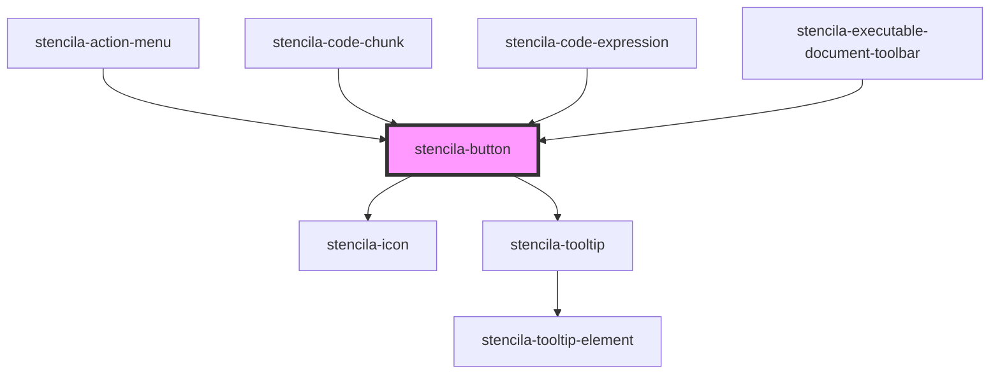

# stencila-button

<!-- Auto Generated Below -->

## Properties

| Property      | Attribute      | Description                                                                                                                                                                                                             | Type                                                                                       | Default     |
| ------------- | -------------- | ----------------------------------------------------------------------------------------------------------------------------------------------------------------------------------------------------------------------- | ------------------------------------------------------------------------------------------ | ----------- |
| `ariaLabel`   | `aria-label`   | Screen-reader accessible label to read out.                                                                                                                                                                             | `string`                                                                                   | `undefined` |
| `buttonType`  | `button-type`  | The type of button to render, options correspond to HTML Button `type` attribute. https://developer.mozilla.org/en-US/docs/Web/HTML/Element/button Only applies if the button is not an anchor link.                    | `"button" \| "reset" \| "submit"`                                                          | `undefined` |
| `color`       | `color`        | The color of the button                                                                                                                                                                                                 | `"brand" \| "danger" \| "key" \| "neutral" \| "primary" \| "stock" \| "success" \| "warn"` | `'primary'` |
| `dataEl`      | `data-el`      | An optional data attribute set on the button element for easier targeting using JavaScript.                                                                                                                             | `string \| undefined`                                                                      | `undefined` |
| `disabled`    | `disabled`     | If true, prevents the user from interacting with the button. Note: Not all browser prevent the click handler from firing on disabled buttons.                                                                           | `boolean`                                                                                  | `false`     |
| `fill`        | `fill`         | If true, the button will take up the full width of the parent container                                                                                                                                                 | `boolean`                                                                                  | `false`     |
| `href`        | `href`         | If an `href` property is provided, button will be rendered using an `<a>` anchor tag.                                                                                                                                   | `string \| undefined`                                                                      | `undefined` |
| `icon`        | `icon`         | Name of the icon to render inside the button                                                                                                                                                                            | `HTMLElement \| IconNames \| undefined`                                                    | `undefined` |
| `iconOnly`    | `icon-only`    | If true, removes extra padding from Icon inside the button TODO: See if we can automatically infer removal of padding through CSS                                                                                       | `boolean`                                                                                  | `false`     |
| `isLoading`   | `is-loading`   | If true, shows a loading spinner icon and sets a `disabled` attribute on the button. Note: Not all browser prevent the click handler from firing on disabled buttons.                                                   | `boolean`                                                                                  | `false`     |
| `isSecondary` | `is-secondary` | Renders the button using a secondory, and usually less visually prominent, Button CSS stylesheet.                                                                                                                       | `boolean`                                                                                  | `false`     |
| `minimal`     | `minimal`      | Renders the button without initial background color or border.                                                                                                                                                          | `boolean`                                                                                  | `false`     |
| `rel`         | `rel`          | Relationship of the link                                                                                                                                                                                                | `string \| undefined`                                                                      | `undefined` |
| `size`        | `size`         | The overall size of the Button.                                                                                                                                                                                         | `"default" \| "large" \| "small" \| "xsmall"`                                              | `'default'` |
| `target`      | `target`       | Determines where to display the linked URL, options correspond to HTML Anchor `target` attribute. Only applies if the button is an anchor link. https://developer.mozilla.org/en-US/docs/Web/HTML/Element/a#attr-target | `string \| undefined`                                                                      | `undefined` |
| `tooltip`     | `tooltip`      | An optional help text to display for button focus and hover states.                                                                                                                                                     | `string \| undefined`                                                                      | `undefined` |

## Dependencies

### Used by

 - [stencila-action-menu](../actionMenu)
 - [stencila-code-chunk](../codeChunk)
 - [stencila-code-expression](../codeExpression)
 - [stencila-executable-document-toolbar](../executableDocumentToolbar)

### Depends on

- [stencila-icon](../icon)
- [stencila-tooltip](../tooltip)

### Graph

----------------------------------------------

*Built with [StencilJS](https://stenciljs.com/)*
