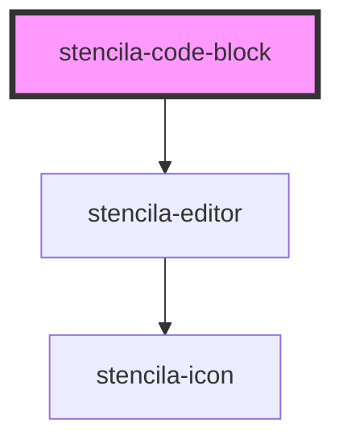

# stencila-code-block

<!-- Auto Generated Below -->

## Properties

| Property              | Attribute              | Description                                                                | Type                           | Default     |
| --------------------- | ---------------------- | -------------------------------------------------------------------------- | ------------------------------ | ----------- |
| `autofocus`           | `autofocus`            | Autofocus the editor on page load                                          | `boolean`                      | `false`     |
| `executableLanguages` | --                     | List of programming languages that can be executed in the current context  | `{ [x: string]: FileFormat; }` | `{}`        |
| `foldGutter`          | `fold-gutter`          | Enables ability to fold sections of code if the syntax package supports it | `boolean`                      | `true`      |
| `keymap`              | --                     | Custom keyboard shortcuts to pass along to CodeMirror                      | `KeyBinding[]`                 | `[]`        |
| `lineNumbers`         | `line-numbers`         | Determines the visibility of line numbers                                  | `boolean`                      | `true`      |
| `lineWrapping`        | `line-wrapping`        | Control line wrapping of text inside the editor                            | `boolean`                      | `false`     |
| `programmingLanguage` | `programming-language` | Programming language of the CodeChunk                                      | `string \| undefined`          | `undefined` |
| `readOnly`            | `read-only`            | Disallow editing of the editor contents when set to `true`                 | `boolean`                      | `false`     |

## Methods

### `getContents() => Promise<CodeBlock>`

Returns the `CodeChunk` node with the updated `text` content from the editor.

#### Returns

Type: `Promise<CodeBlock>`

## Slots

| Slot        | Description                                                                                                     |
| ----------- | --------------------------------------------------------------------------------------------------------------- |
| `"caption"` | `figcaption` content of the `CodeChunk`. Corresponds to the `caption` field in the Stencila `CodeChunk` Schema. |
| `"label"`   | `label` element label of the `CodeChunk`. Corresponds to the `label` field in the Stencila `CodeChunk` Schema.  |
| `"text"`    | The source code of the `CodeChunk`. Corresponds to the `text` field in the Stencila `CodeChunk` Schema.         |

## CSS Custom Properties

| Name                  | Description                                                            |
| --------------------- | ---------------------------------------------------------------------- |
| `--background-editor` | Background color of the Code Editor section                            |
| `--border`            | Border color around the component as well as internal section dividers |

## Dependencies

### Depends on

- [stencila-editor](../editor)

### Graph

----------------------------------------------

*Built with [StencilJS](https://stenciljs.com/)*
