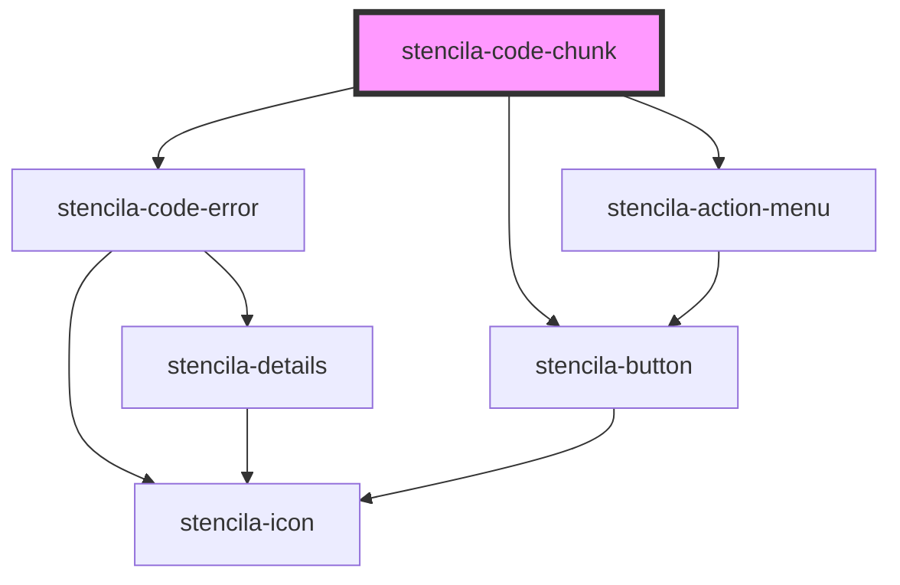

# stencila-code-chunk

<!-- Auto Generated Below -->

## Properties

| Property                  | Attribute                  | Description                                | Type                                           | Default     |
| ------------------------- | -------------------------- | ------------------------------------------ | ---------------------------------------------- | ----------- |
| `executeHandler`          | --                         |                                            | `(codeChunk: CodeChunk) => Promise<CodeChunk>` | `undefined` |
| `isCodeCollapsedProp`     | `data-collapsed`           | Whether the code section is visible or not | `boolean`                                      | `false`     |
| `programmingLanguageProp` | `data-programminglanguage` | Programming language of the CodeChunk      | `string`                                       | `undefined` |

## Events

| Event             | Description | Type               |
| ----------------- | ----------- | ------------------ |
| `collapseAllCode` |             | `CustomEvent<any>` |

## Methods

### `getJSON() => Promise<unknown>`

#### Returns

Type: `Promise<unknown>`

## Dependencies

### Depends on

- [stencila-code-error](../error)
- [stencila-action-menu](../actionMenu)
- [stencila-button](../button)

### Graph

----------------------------------------------

*Built with [StencilJS](https://stenciljs.com/)*
