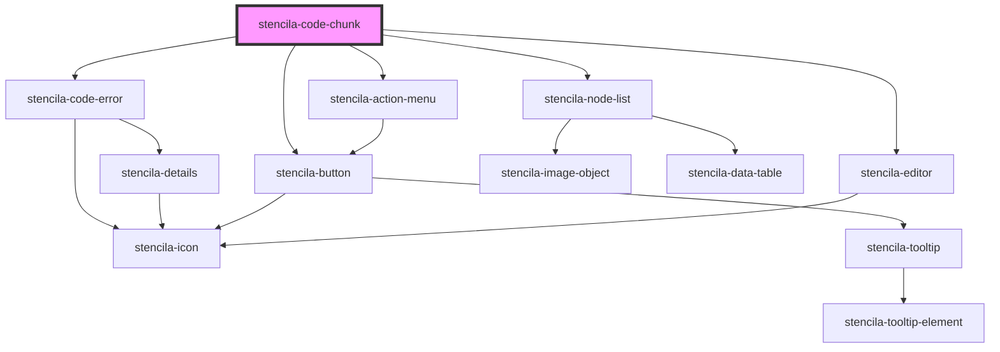

# stencila-code-chunk

<!-- Auto Generated Below -->

## Properties

| Property                  | Attribute                  | Description                                                                                            | Type                                           | Default     |
| ------------------------- | -------------------------- | ------------------------------------------------------------------------------------------------------ | ---------------------------------------------- | ----------- |
| `autofocus`               | `autofocus`                | Autofocus the editor on page load                                                                      | `boolean`                                      | `false`     |
| `executeHandler`          | --                         | A callback function to be called with the value of the `CodeChunk` node when execting the `CodeChunk`. | `(codeChunk: CodeChunk) => Promise<CodeChunk>` | `undefined` |
| `isCodeVisibleProp`       | `data-collapsed`           | Whether the code section is visible or not                                                             | `boolean`                                      | `false`     |
| `keymap`                  | --                         | Custom keyboard shortcuts to pass along to CodeMirror                                                  | `KeyBinding[]`                                 | `[]`        |
| `onSetLanguage`           | --                         | Callback function to call when a language of the editor is changed                                     | `(language: string) => void`                   | `undefined` |
| `programmingLanguageProp` | `data-programminglanguage` | Programming language of the CodeChunk                                                                  | `string`                                       | `undefined` |

## Events

| Event             | Description                                                                                                                           | Type               |
| ----------------- | ------------------------------------------------------------------------------------------------------------------------------------- | ------------------ |
| `collapseAllCode` | Trigger a global DOM event to hide or show all `CodeChunk` and `CodeExpress` component source code, leaving only the results visible. | `CustomEvent<any>` |

## Methods

### `getContents() => Promise<CodeChunk>`

Returns the `CodeChunk` node with the updated `text` content from the editor.

#### Returns

Type: `Promise<CodeChunk>`

## CSS Custom Properties

| Name                  | Description                                                            |
| --------------------- | ---------------------------------------------------------------------- |
| `--background`        | Background color of the Code Output section                            |
| `--background-editor` | Background color of the Code Editor section                            |
| `--border`            | Border color around the component as well as internal section dividers |

## Dependencies

### Depends on

- [stencila-code-error](../error)
- [stencila-action-menu](../actionMenu)
- [stencila-button](../button)
- [stencila-editor](../editor)
- [stencila-node-list](../nodeList)

### Graph

----------------------------------------------

*Built with [StencilJS](https://stenciljs.com/)*
