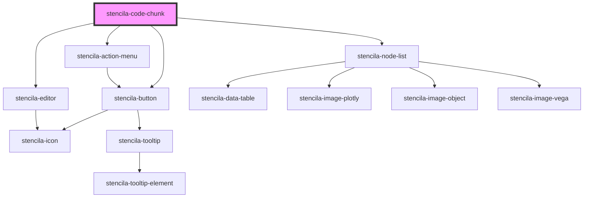

# stencila-code-chunk

<!-- Auto Generated Below -->

## Properties

| Property                           | Attribute                  | Description                                                                                                                                                                                                      | Type                                                          | Default                                 |
| ---------------------------------- | -------------------------- | ---------------------------------------------------------------------------------------------------------------------------------------------------------------------------------------------------------------- | ------------------------------------------------------------- | --------------------------------------- |
| `autofocus`                        | `autofocus`                | Autofocus the editor on page load                                                                                                                                                                                | `boolean`                                                     | `false`                                 |
| `executeHandler`                   | --                         | A callback function to be called with the value of the `CodeChunk` node when executing the `CodeChunk`.                                                                                                          | `((codeChunk: CodeChunk) => Promise<CodeChunk>) \| undefined` | `undefined`                             |
| `isCodeVisible`                    | `is-code-visible`          | Whether the code section is visible or not                                                                                                                                                                       | `boolean`                                                     | `false`                                 |
| `keymap`                           | --                         | Custom keyboard shortcuts to pass along to CodeMirror                                                                                                                                                            | `KeyBinding[]`                                                | `[]`                                    |
| `programmingLanguage`              | `programming-language`     | Programming language of the CodeChunk                                                                                                                                                                            | `string \| undefined`                                         | `this.programmingLanguageDataAttribute` |
| `programmingLanguageDataAttribute` | `data-programminglanguage` | **[DEPRECATED]** Legacy method for defining the programming language of the CodeChunk Use `programmingLanguage` prop, or `programming-language` HTML attribute instead.   | `string \| undefined`                                         | `undefined`                             |

## Events

| Event                  | Description                                                                                                                                                     | Type               |
| ---------------------- | --------------------------------------------------------------------------------------------------------------------------------------------------------------- | ------------------ |
| `setAllCodeVisibility` | Trigger a global DOM event to hide or show all `CodeChunk` and `CodeExpress` component source code, leaving only the results visible.                           | `CustomEvent<any>` |
| `setEditorLayout`      | Trigger a global DOM event to set the layout of all `CodeChunk` component. Can be set to either show the editor and outputs side by side or stacked vertically. | `CustomEvent<any>` |

## Methods

### `execute() => Promise<CodeChunk>`

Run the `CodeChunk`

#### Returns

Type: `Promise<CodeChunk>`

### `getContents() => Promise<CodeChunk>`

Returns the `CodeChunk` node with the updated `text` content from the editor.

#### Returns

Type: `Promise<CodeChunk>`

## CSS Custom Properties

| Name                  | Description                                                            |
| --------------------- | ---------------------------------------------------------------------- |
| `--background`        | Background color of the Code Output section                            |
| `--background-editor` | Background color of the Code Editor section                            |
| `--border`            | Border color around the component as well as internal section dividers |

## Dependencies

### Depends on

- [stencila-action-menu](../actionMenu)
- [stencila-button](../button)
- [stencila-editor](../editor)
- [stencila-node-list](../nodeList)

### Graph

----------------------------------------------

*Built with [StencilJS](https://stenciljs.com/)*
