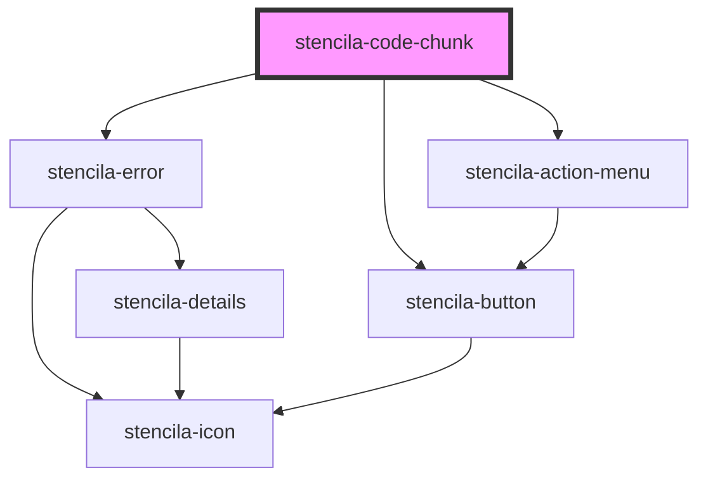

# stencila-button

<!-- Auto Generated Below -->

## Properties

| Property              | Attribute        | Description                                | Type                                   | Default     |
| --------------------- | ---------------- | ------------------------------------------ | -------------------------------------- | ----------- |
| `executeHandler`      | --               |                                            | `(text: string) => Promise<CodeChunk>` | `undefined` |
| `isCodeCollapsedProp` | `data-collapsed` | Whether the code section is visible or not | `boolean`                              | `false`     |

## Events

| Event             | Description | Type               |
| ----------------- | ----------- | ------------------ |
| `collapseAllCode` |             | `CustomEvent<any>` |

## Dependencies

### Depends on

- [stencila-error](../error)
- [stencila-action-menu](../actionMenu)
- [stencila-button](../button)

### Graph

----------------------------------------------

*Built with [StencilJS](https://stenciljs.com/)*
