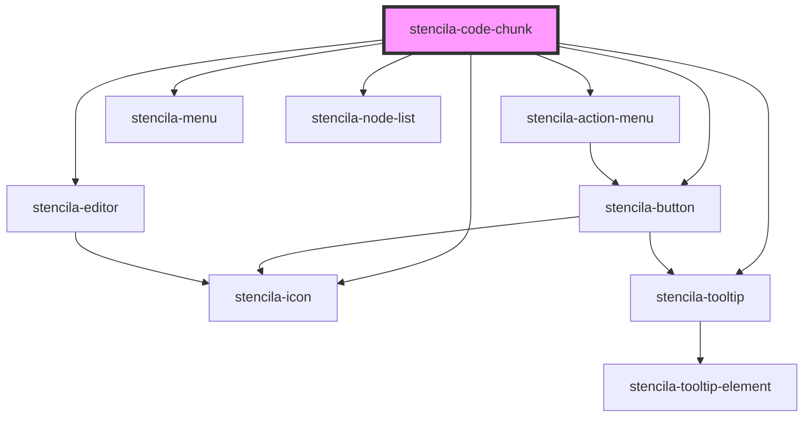

# stencila-code-chunk

<!-- Auto Generated Below -->

## Properties

| Property               | Attribute              | Description                                                                                             | Type                                                                                                                                          | Default         |
| ---------------------- | ---------------------- | ------------------------------------------------------------------------------------------------------- | --------------------------------------------------------------------------------------------------------------------------------------------- | --------------- |
| `autofocus`            | `autofocus`            | Autofocus the editor on page load                                                                       | `boolean`                                                                                                                                     | `false`         |
| `compileDigest`        | `compile-digest`       | A digest representing the state of a [`Resource`] and its dependencies at compile time.                 | `string`                                                                                                                                      | `undefined`     |
| `contentChangeHandler` | --                     | Callback function to invoke whenever the editor contents are updated.                                   | `((updateEvent?: ViewUpdate \| undefined) => void) \| undefined`                                                                              | `undefined`     |
| `executableLanguages`  | --                     | List of programming languages that can be executed in the current context                               | `undefined \| { [x: string]: FileFormat; }`                                                                                                   | `undefined`     |
| `executeDigest`        | `execute-digest`       | A digest representing the state of a [`Resource`] and its dependencies from the latest execution.       | `string`                                                                                                                                      | `undefined`     |
| `executeDuration`      | `execute-duration`     | Duration of the latest code execition                                                                   | `string`                                                                                                                                      | `undefined`     |
| `executeEnded`         | `execute-ended`        | Time when the latest code execution ended                                                               | `string`                                                                                                                                      | `undefined`     |
| `executeHandler`       | --                     | A callback function to be called with the value of the `CodeChunk` node when executing the `CodeChunk`. | `((codeChunk: CodeChunk) => Promise<CodeChunk>) \| undefined`                                                                                 | `undefined`     |
| `executeRequired`      | `execute-required`     | Status of upstream dependencies, and whether the node needs to be re-executed                           | `"DependenciesChanged" \| "DependenciesFailed" \| "NeverExecuted" \| "No" \| "SemanticsChanged"`                                              | `undefined`     |
| `executeStatus`        | `execute-status`       | The execution status of the code node                                                                   | `"Cancelled" \| "Failed" \| "Running" \| "RunningPreviouslyFailed" \| "Scheduled" \| "ScheduledPreviouslyFailed" \| "Succeeded" \| undefined` | `undefined`     |
| `isCodeVisible`        | `is-code-visible`      | Whether the code section is visible or not                                                              | `boolean`                                                                                                                                     | `false`         |
| `keymap`               | --                     | Custom keyboard shortcuts to pass along to CodeMirror                                                   | `KeyBinding[]`                                                                                                                                | `[]`            |
| `languageCapabilities` | --                     | List of all supported programming languages                                                             | `{ [x: string]: FileFormat; }`                                                                                                                | `fileFormatMap` |
| `programmingLanguage`  | `programming-language` | Programming language of the CodeChunk                                                                   | `string \| undefined`                                                                                                                         | `undefined`     |
| `text`                 | `text`                 |                                                                                                         | `string \| undefined`                                                                                                                         | `undefined`     |

## Events

| Event                             | Description                                                                                                                                                     | Type                                                         |
| --------------------------------- | --------------------------------------------------------------------------------------------------------------------------------------------------------------- | ------------------------------------------------------------ |
| `stencila-code-execute`           | Emitted to indicate that code node should be executed                                                                                                           | `CustomEvent<{ nodeId: string; }>`                           |
| `stencila-code-execute-cancel`    | Emitted to indicate that the execution of the code node should be cancelled/interrupted.                                                                        | `CustomEvent<{ nodeId: string; scope: "Single" \| "All"; }>` |
| `stencila-code-visibility-change` | Trigger a global DOM event to hide or show all `CodeChunk` and `CodeExpress` component source code, leaving only the results visible.                           | `CustomEvent<any>`                                           |
| `stencila-editor-layout-change`   | Trigger a global DOM event to set the layout of all `CodeChunk` component. Can be set to either show the editor and outputs side by side or stacked vertically. | `CustomEvent<any>`                                           |

## Methods

### `execute() => Promise<CodeChunk | Error>`

Run the `CodeChunk`

#### Returns

Type: `Promise<CodeChunk | Error>`

### `getContents() => Promise<CodeChunk>`

Returns the `CodeChunk` node with the updated `text` content from the editor.

#### Returns

Type: `Promise<CodeChunk>`

### `getRef() => Promise<EditorView | undefined>`

Retrieve a reference to the internal CodeMirror editor.
Allows for maintaining state from applications making use of this component.

#### Returns

Type: `Promise<EditorView | undefined>`

### `getTextContents() => Promise<string>`

Returns the text contents from the editor

#### Returns

Type: `Promise<string>`

## Slots

| Slot        | Description                                                                                                                |
| ----------- | -------------------------------------------------------------------------------------------------------------------------- |
| `"caption"` | `figcaption` content of the `CodeChunk`. Corresponds to the `caption` field in the Stencila `CodeChunk` Schema.            |
| `"errors"`  | List of any errors encountered when compiling (e.g. syntax errors) or executing the CodeChunk.                             |
| `"label"`   | `label` element label of the `CodeChunk`. Corresponds to the `label` field in the Stencila `CodeChunk` Schema.             |
| `"outputs"` | The resulting output when evaluating the CodeChunk. Corresponds to the `outputs` field in the Stencila `CodeChunk` Schema. |
| `"text"`    | The source code of the `CodeChunk`. Corresponds to the `text` field in the Stencila `CodeChunk` Schema.                    |

## CSS Custom Properties

| Name                  | Description                                                            |
| --------------------- | ---------------------------------------------------------------------- |
| `--background`        | Background color of the Code Output section                            |
| `--background-editor` | Background color of the Code Editor section                            |
| `--border`            | Border color around the component as well as internal section dividers |

## Dependencies

### Depends on

- [stencila-action-menu](../actionMenu)
- [stencila-menu](../menu)
- [stencila-button](../button)
- [stencila-editor](../editor)
- [stencila-node-list](../nodeList)
- [stencila-icon](../icon)
- [stencila-tooltip](../tooltip)

### Graph

----------------------------------------------

*Built with [StencilJS](https://stenciljs.com/)*
