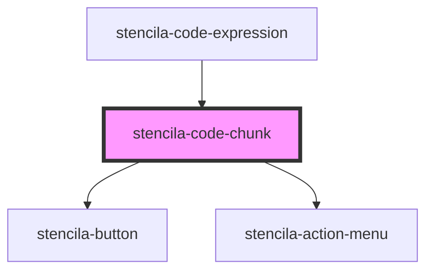

# stencila-button

<!-- Auto Generated Below -->

## Properties

| Property              | Attribute        | Description                                | Type      | Default |
| --------------------- | ---------------- | ------------------------------------------ | --------- | ------- |
| `isCodeCollapsedProp` | `data-collapsed` | Whether the code section is visible or not | `boolean` | `false` |

## Events

| Event             | Description | Type               |
| ----------------- | ----------- | ------------------ |
| `collapseAllCode` |             | `CustomEvent<any>` |

## Dependencies

### Used by

 - [stencila-code-expression](../codeExpression)

### Depends on

- [stencila-button](../button)
- [stencila-action-menu](../actionMenu)

### Graph

----------------------------------------------

*Built with [StencilJS](https://stenciljs.com/)*
