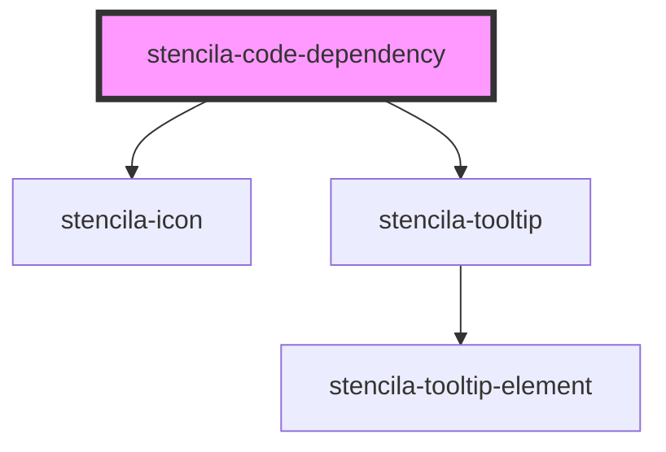

# stencila-code-dependency

<!-- Auto Generated Below -->

## Properties

| Property              | Attribute              | Description                                                                                                       | Type                                                                                                                                          | Default     |
| --------------------- | ---------------------- | ----------------------------------------------------------------------------------------------------------------- | --------------------------------------------------------------------------------------------------------------------------------------------- | ----------- |
| `executeAuto`         | `execute-auto`         | Whether the dependency should be automatically re-executed based on semantic analysis of the code.                | `"Always" \| "Auto" \| "Never"`                                                                                                               | `undefined` |
| `executeRequired`     | `execute-required`     | Status of upstream dependencies, and whether the node needs to be re-executed                                     | `"DependenciesChanged" \| "DependenciesFailed" \| "Failed" \| "NeverExecuted" \| "No" \| "SemanticsChanged" \| undefined`                     | `undefined` |
| `executeStatus`       | `execute-status`       | The execution status of the code node                                                                             | `"Cancelled" \| "Failed" \| "Running" \| "RunningPreviouslyFailed" \| "Scheduled" \| "ScheduledPreviouslyFailed" \| "Succeeded" \| undefined` | `undefined` |
| `label`               | `label`                | User assigned label for the node                                                                                  | `string \| undefined`                                                                                                                         | `undefined` |
| `nodeId`              | `node-id`              | The Node ID, should match the HTML `id` attribute.                                                                | `string`                                                                                                                                      | `undefined` |
| `nodeKind`            | `node-kind`            | Node kind, such as `CodeChunk`, `CodeExpression`, `Parameter`, etc. Aligns with the Stencila Schema node types.   | `string`                                                                                                                                      | `undefined` |
| `programmingLanguage` | `programming-language` | Programming language of the CodeExpression, note that not all nodes have this property (`Parameter` for example). | `string \| undefined`                                                                                                                         | `undefined` |

## Dependencies

### Depends on

- [stencila-icon](../icon)
- [stencila-tooltip](../tooltip)

### Graph

----------------------------------------------

*Built with [StencilJS](https://stenciljs.com/)*
