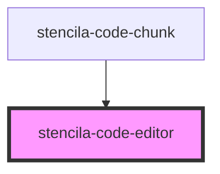

# stencila-code-editor

<!-- Auto Generated Below -->

## Properties

| Property               | Attribute              | Description                                                  | Type                                           | Default                    |
| ---------------------- | ---------------------- | ------------------------------------------------------------ | ---------------------------------------------- | -------------------------- |
| `executeHandler`       | --                     | Function to be evaluated over the contents of the CodeChunk. | `(codeChunk: CodeChunk) => Promise<CodeChunk>` | `undefined`                |
| `lineNumbers`          | `line-numbers`         | Determines the visibility of line numbers                    | `boolean`                                      | `true`                     |
| `programmingLanguage`  | `programming-language` | Programming language of the CodeEditor                       | `string`                                       | `undefined`                |
| `programmingLanguages` | --                     | List of all supported programming languages                  | `string[]`                                     | `['Python', 'JavaScript']` |

## Methods

### `getJSON() => Promise<import("/Users/ketch/Work/Stencila/designa/packages/components/node_modules/@stencila/schema/dist/types").CodeChunk>`

Public method, returning the CodeChunk contents as Stencila JSON.

#### Returns

Type: `Promise<CodeChunk>`

## Dependencies

### Used by

 - [stencila-code-chunk](../codeChunk)

### Graph

----------------------------------------------

*Built with [StencilJS](https://stenciljs.com/)*
