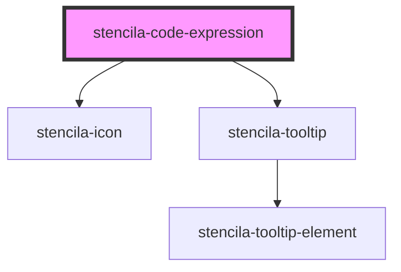

# stencila-code-expression

<!-- Auto Generated Below -->

## Properties

| Property         | Attribute | Description                                                                                                      | Type                                                          | Default     |
| ---------------- | --------- | ---------------------------------------------------------------------------------------------------------------- | ------------------------------------------------------------- | ----------- |
| `executeHandler` | --        | A callback function to be called with the value of the `CodeExpression` node when execting the `CodeExpression`. | `(codeExpression: CodeExpression) => Promise<CodeExpression>` | `undefined` |

## Methods

### `getContents() => Promise<CodeExpression>`

Returns the `CodeExpression` node with the updated `text` contents from the editor.

#### Returns

Type: `Promise<CodeExpression>`

## Dependencies

### Depends on

- [stencila-icon](../icon)
- [stencila-tooltip](../tooltip)

### Graph

----------------------------------------------

*Built with [StencilJS](https://stenciljs.com/)*
