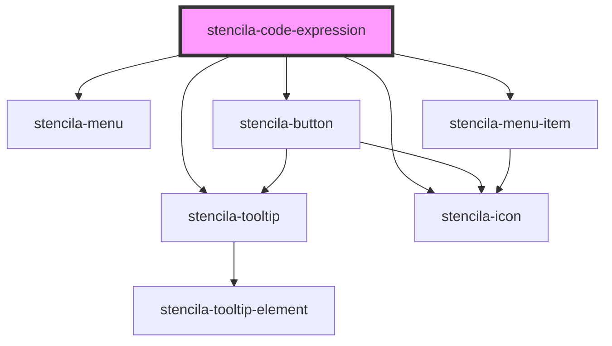

# stencila-code-expression

<!-- Auto Generated Below -->

## Properties

| Property               | Attribute              | Description                                                                                                       | Type                                                                                                                                          | Default                                               |
| ---------------------- | ---------------------- | ----------------------------------------------------------------------------------------------------------------- | --------------------------------------------------------------------------------------------------------------------------------------------- | ----------------------------------------------------- |
| `codeExpression`       | --                     | Stencila CodeExpression node to render                                                                            | `CodeExpression \| undefined`                                                                                                                 | `undefined`                                           |
| `compileDigest`        | `compile-digest`       | A digest representing the state of a [`Resource`] and its dependencies at compile time.                           | `string`                                                                                                                                      | `undefined`                                           |
| `executableLanguages`  | --                     | List of programming languages that can be executed in the current context                                         | `{ [x: string]: FileFormat; }`                                                                                                                | `window.stencilaWebClient?.executableLanguages ?? {}` |
| `executeDigest`        | `execute-digest`       | A digest representing the state of a [`Resource`] and its dependencies from the latest execution.                 | `string`                                                                                                                                      | `undefined`                                           |
| `executeDuration`      | `execute-duration`     | Duration of the latest code execition                                                                             | `string`                                                                                                                                      | `undefined`                                           |
| `executeEnded`         | `execute-ended`        | Time when the latest code execution ended                                                                         | `string`                                                                                                                                      | `undefined`                                           |
| `executeHandler`       | --                     | A callback function to be called with the value of the `CodeExpression` node when executing the `CodeExpression`. | `((codeExpression: CodeExpression) => Promise<CodeExpression>) \| undefined`                                                                  | `undefined`                                           |
| `executeRequired`      | `execute-required`     | Status of upstream dependencies, and whether the node needs to be re-executed                                     | `"DependenciesChanged" \| "DependenciesFailed" \| "NeverExecuted" \| "No" \| "SemanticsChanged"`                                              | `undefined`                                           |
| `executeStatus`        | `execute-status`       | The execution status of the code node                                                                             | `"Cancelled" \| "Failed" \| "Running" \| "RunningPreviouslyFailed" \| "Scheduled" \| "ScheduledPreviouslyFailed" \| "Succeeded" \| undefined` | `undefined`                                           |
| `languageCapabilities` | --                     | List of all supported programming languages                                                                       | `{ [x: string]: FileFormat; }`                                                                                                                | `fileFormatMap`                                       |
| `programmingLanguage`  | `programming-language` | Programming language of the CodeExpression                                                                        | `string`                                                                                                                                      | `undefined`                                           |
| `readOnly`             | `read-only`            | Disallow editing of the editor contents when set to `true`                                                        | `boolean`                                                                                                                                     | `false`                                               |

## Events

| Event                          | Description                                                                              | Type                                                                                            |
| ------------------------------ | ---------------------------------------------------------------------------------------- | ----------------------------------------------------------------------------------------------- |
| `stencila-code-execute`        | Emitted to indicate that code node should be executed                                    | `CustomEvent<{ nodeId: string \| null; ordering: "Single" \| "Appearance" \| "Topological"; }>` |
| `stencila-code-execute-cancel` | Emitted to indicate that the execution of the code node should be cancelled/interrupted. | `CustomEvent<{ nodeId: string \| null; scope: "Single" \| "All"; }>`                            |
| `stencila-content-change`      | Event emitted when the source code of the `CodeExpression` node is changed.              | `CustomEvent<string>`                                                                           |
| `stencila-language-change`     | Event emitted when the language of the editor is changed.                                | `CustomEvent<{ name: string; ext: string \| null; aliases: string[]; }>`                        |

## Methods

### `execute() => Promise<CodeExpression | Error>`

Run the `CodeExpression`

#### Returns

Type: `Promise<CodeExpression | Error>`

### `getContents() => Promise<CodeExpression>`

Returns the `CodeExpression` node with the updated `text` contents from the
editor.

#### Returns

Type: `Promise<CodeExpression>`

### `getTextContents() => Promise<string>`

Returns the text contents from the inline code editor

#### Returns

Type: `Promise<string>`

## Slots

| Slot       | Description                                                                                                         |
| ---------- | ------------------------------------------------------------------------------------------------------------------- |
| `"output"` | A single output element. Corresponds to the `output` field in          the Stencila `CodeExpression` Schema.        |
| `"text"`   | The source code of the `CodeChunk`. Corresponds to the `text`        field in the Stencila `CodeExpression` Schema. |

## CSS Custom Properties

| Name                   | Description                                                            |
| ---------------------- | ---------------------------------------------------------------------- |
| `--background`         | Background color of the Code Output section                            |
| `--background-buttons` | Background color of the Code Editor section                            |
| `--background-editor`  | Background color of the Code Editor section                            |
| `--border`             | Border color around the component as well as internal section dividers |

## Dependencies

### Depends on

- [stencila-menu](../menu)
- [stencila-button](../button)
- [stencila-tooltip](../tooltip)
- [stencila-icon](../icon)
- [stencila-menu-item](../menuItem)

### Graph

----------------------------------------------

*Built with [StencilJS](https://stenciljs.com/)*
