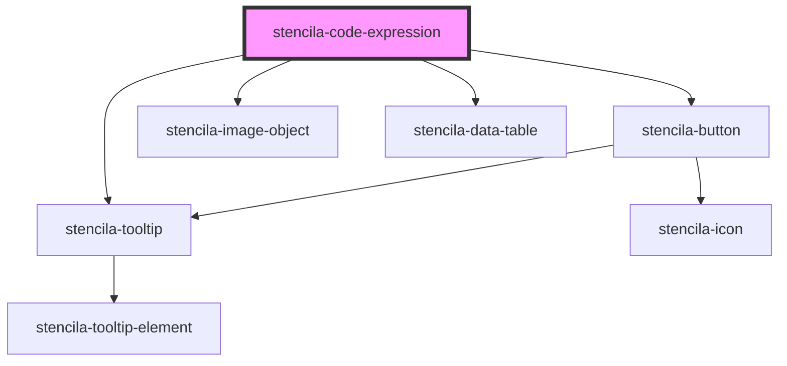

# stencila-code-expression

<!-- Auto Generated Below -->

## Properties

| Property              | Attribute              | Description                                                                                                      | Type                                                                         | Default     |
| --------------------- | ---------------------- | ---------------------------------------------------------------------------------------------------------------- | ---------------------------------------------------------------------------- | ----------- |
| `executeHandler`      | --                     | A callback function to be called with the value of the `CodeExpression` node when execting the `CodeExpression`. | `((codeExpression: CodeExpression) => Promise<CodeExpression>) \| undefined` | `undefined` |
| `programmingLanguage` | `programming-language` | Programming language of the CodeExpression                                                                       | `string`                                                                     | `undefined` |

## Methods

### `execute() => Promise<CodeExpression>`

Run the `CodeExpression`

#### Returns

Type: `Promise<CodeExpression>`

### `getContents() => Promise<CodeExpression>`

Returns the `CodeExpression` node with the updated `text` contents from the editor.

#### Returns

Type: `Promise<CodeExpression>`

## CSS Custom Properties

| Name                   | Description                                                            |
| ---------------------- | ---------------------------------------------------------------------- |
| `--background`         | Background color of the Code Output section                            |
| `--background-buttons` | Background color of the Code Editor section                            |
| `--background-editor`  | Background color of the Code Editor section                            |
| `--border`             | Border color around the component as well as internal section dividers |

## Dependencies

### Depends on

- [stencila-button](../button)
- [stencila-tooltip](../tooltip)
- [stencila-image-object](../imageObject)
- [stencila-data-table](../dataTable)

### Graph

----------------------------------------------

*Built with [StencilJS](https://stenciljs.com/)*
