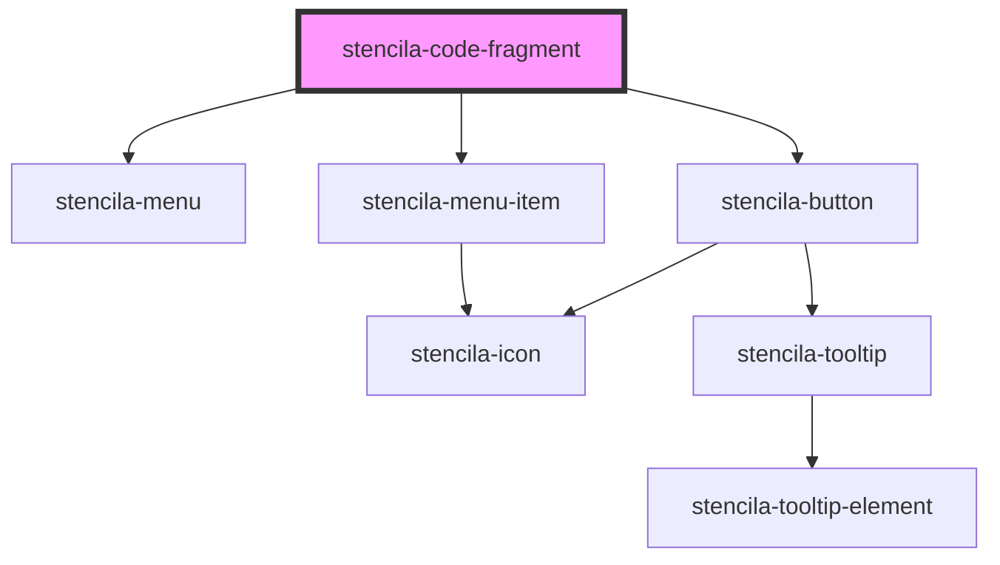

# stencila-code-fragment

<!-- Auto Generated Below -->

## Properties

| Property               | Attribute              | Description                                                                                      | Type                           | Default                                               |
| ---------------------- | ---------------------- | ------------------------------------------------------------------------------------------------ | ------------------------------ | ----------------------------------------------------- |
| `executableLanguages`  | --                     | List of programming languages that can be executed in the current context                        | `{ [x: string]: FileFormat; }` | `window.stencilaWebClient?.executableLanguages ?? {}` |
| `languageCapabilities` | --                     | List of all supported programming languages                                                      | `{ [x: string]: FileFormat; }` | `fileFormatMap`                                       |
| `mode`                 | `mode`                 | The context of the component. In `read` mode the code content and its language cannot be edited. | `"edit" \| "read"`             | `'read'`                                              |
| `programmingLanguage`  | `programming-language` | Programming language of the CodeFragment                                                         | `string \| undefined`          | `undefined`                                           |

## Events

| Event                      | Description                                                                 | Type                                                                     |
| -------------------------- | --------------------------------------------------------------------------- | ------------------------------------------------------------------------ |
| `stencila-content-change`  | Event emitted when the source code of the `CodeExpression` node is changed. | `CustomEvent<string>`                                                    |
| `stencila-language-change` | Event emitted when the language of the editor is changed.                   | `CustomEvent<{ name: string; ext: string \| null; aliases: string[]; }>` |

## Methods

### `getTextContents() => Promise<string>`

Returns the text contents from the inline code editor

#### Returns

Type: `Promise<string>`

## Slots

| Slot     | Description                       |
| -------- | --------------------------------- |
| `"text"` | The contents of the code fragment |

## CSS Custom Properties

| Name                   | Description                                                            |
| ---------------------- | ---------------------------------------------------------------------- |
| `--background`         | Background color of the Code Fragment                                  |
| `--background-buttons` | Background color of the Code Editor section                            |
| `--border`             | Border color around the component as well as internal section dividers |

## Dependencies

### Depends on

- [stencila-menu](../menu)
- [stencila-button](../button)
- [stencila-menu-item](../menuItem)

### Graph

----------------------------------------------

*Built with [StencilJS](https://stenciljs.com/)*
