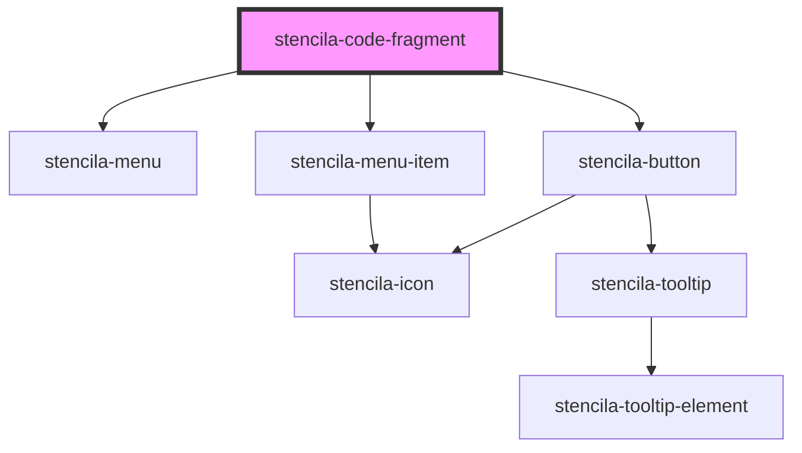

# stencila-code-fragment

<!-- Auto Generated Below -->

## Properties

| Property              | Attribute              | Description                                                | Type                  | Default     |
| --------------------- | ---------------------- | ---------------------------------------------------------- | --------------------- | ----------- |
| `programmingLanguage` | `programming-language` | Programming language of the CodeFragment                   | `string \| undefined` | `undefined` |
| `readOnly`            | `read-only`            | Disallow editing of the editor contents when set to `true` | `boolean`             | `false`     |

## Events

| Event                      | Description                                               | Type                                                                     |
| -------------------------- | --------------------------------------------------------- | ------------------------------------------------------------------------ |
| `stencila-language-change` | Event emitted when the language of the editor is changed. | `CustomEvent<{ name: string; ext: string \| null; aliases: string[]; }>` |

## Slots

| Slot        | Description                       |
| ----------- | --------------------------------- |
| `"default"` | The contents of the code fragment |

## CSS Custom Properties

| Name                   | Description                                                            |
| ---------------------- | ---------------------------------------------------------------------- |
| `--background`         | Background color of the Code Fragment                                  |
| `--background-buttons` | Background color of the Code Editor section                            |
| `--border`             | Border color around the component as well as internal section dividers |

## Dependencies

### Depends on

- [stencila-menu](../menu)
- [stencila-button](../button)
- [stencila-menu-item](../menuItem)

### Graph

----------------------------------------------

*Built with [StencilJS](https://stenciljs.com/)*
