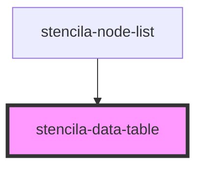

# stencila-data-table

<!-- Auto Generated Below -->

## Properties

| Property | Attribute | Description                    | Type        | Default     |
| -------- | --------- | ------------------------------ | ----------- | ----------- |
| `table`  | --        | The `Datatable` node to render | `Datatable` | `undefined` |

## Dependencies

### Used by

 - [stencila-node-list](../nodeList)

### Graph

----------------------------------------------

*Built with [StencilJS](https://stenciljs.com/)*
