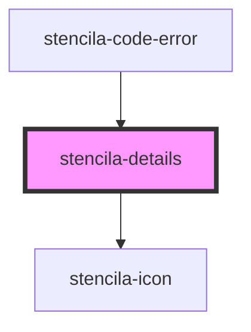

# stencila-details

<!-- Auto Generated Below -->

## Properties

| Property | Attribute | Description                                         | Type                   | Default     |
| -------- | --------- | --------------------------------------------------- | ---------------------- | ----------- |
| `open`   | `open`    | Determines whether the contents are visible or not. | `boolean \| undefined` | `undefined` |

## CSS Custom Properties

| Name                      | Description                                                                                                                |
| ------------------------- | -------------------------------------------------------------------------------------------------------------------------- |
| `--disclosure-icon-right` | Position of the disclosure toggle icon relative to the right boundary of the closest relatively positioned parent element. |
| `--disclosure-icon-top`   | Position of the disclosure toggle icon relative to the top boundary of the closest relatively positioned parent element.   |

## Dependencies

### Used by

 - [stencila-code-error](../error)

### Depends on

- [stencila-icon](../icon)

### Graph

----------------------------------------------

*Built with [StencilJS](https://stenciljs.com/)*
