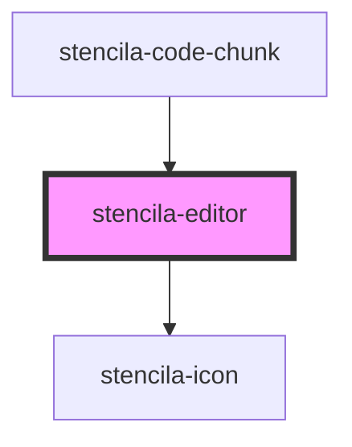

# stencila-editor

<!-- Auto Generated Below -->

## Properties

| Property               | Attribute         | Description                                                        | Type                                                            | Default                                             |
| ---------------------- | ----------------- | ------------------------------------------------------------------ | --------------------------------------------------------------- | --------------------------------------------------- |
| `activeLanguage`       | `active-language` | Programming language of the Editor                                 | `string`                                                        | `this.languageCapabilities[0]?.toLowerCase() ?? ''` |
| `autofocus`            | `autofocus`       | Autofocus the editor on page load                                  | `boolean`                                                       | `false`                                             |
| `executeHandler`       | --                | Function to be evaluated over the contents of the editor.          | `((contents: EditorContents) => Promise<unknown>) \| undefined` | `undefined`                                         |
| `foldGutter`           | `fold-gutter`     | Enables abiility to fold sections of code                          | `boolean`                                                       | `true`                                              |
| `keymap`               | --                | Custom keyboard shortcuts to pass along to CodeMirror              | `KeyBinding[]`                                                  | `[]`                                                |
| `languageCapabilities` | --                | List of all supported programming languages                        | `string[]`                                                      | `['Bash', 'R', 'Python']`                           |
| `lineNumbers`          | `line-numbers`    | Determines the visibility of line numbers                          | `boolean`                                                       | `true`                                              |
| `onSetLanguage`        | --                | Callback function to call when a language of the editor is changed | `((language: string) => void) \| undefined`                     | `undefined`                                         |
| `readOnly`             | `read-only`       | Disallow editing of the editor contents when set to `true`         | `boolean`                                                       | `false`                                             |

## Methods

### `getContents() => Promise<EditorContents>`

Public method, returning the Editor contents and active language.

#### Returns

Type: `Promise<EditorContents>`

### `setContents(contents: string) => Promise<string>`

Public method, to replace the contents of the Editor with a supplied string.

#### Returns

Type: `Promise<string>`

## CSS Custom Properties

| Name                       | Description                                        |
| -------------------------- | -------------------------------------------------- |
| `--line-number-background` | Background color of the Editor Line Numbers gutter |

## Dependencies

### Used by

 - [stencila-code-chunk](../codeChunk)

### Depends on

- [stencila-icon](../icon)

### Graph

----------------------------------------------

*Built with [StencilJS](https://stenciljs.com/)*
