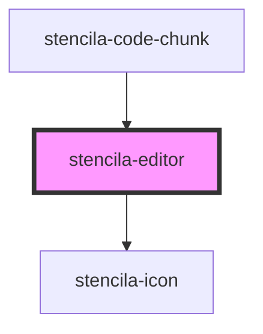

# stencila-editor

<!-- Auto Generated Below -->

## Properties

| Property               | Attribute         | Description                                                                                                                            | Type                                                            | Default                                             |
| ---------------------- | ----------------- | -------------------------------------------------------------------------------------------------------------------------------------- | --------------------------------------------------------------- | --------------------------------------------------- |
| `activeLanguage`       | `active-language` | Programming language of the Editor                                                                                                     | `string`                                                        | `this.languageCapabilities[0]?.toLowerCase() ?? ''` |
| `autofocus`            | `autofocus`       | Autofocus the editor on page load                                                                                                      | `boolean`                                                       | `false`                                             |
| `contents`             | `contents`        | Text contents of the editor                                                                                                            | `string \| undefined`                                           | `undefined`                                         |
| `errors`               | --                | List of errors to display at the bottom of the code editor section. If the error is a `string`, then it will be rendered as a warning. | `CodeError[] \| string[] \| undefined`                          | `undefined`                                         |
| `executeHandler`       | --                | Function to be evaluated over the contents of the editor.                                                                              | `((contents: EditorContents) => Promise<unknown>) \| undefined` | `undefined`                                         |
| `foldGutter`           | `fold-gutter`     | Enables ability to fold sections of code if the syntax package supports it                                                             | `boolean`                                                       | `true`                                              |
| `isControlled`         | `is-controlled`   | Disable language and other editor configuration management, deferring control to consuming applications                                | `boolean`                                                       | `false`                                             |
| `keymap`               | --                | Custom keyboard shortcuts to pass along to CodeMirror                                                                                  | `KeyBinding[]`                                                  | `[]`                                                |
| `languageCapabilities` | --                | List of all supported programming languages                                                                                            | `string[]`                                                      | `defaultLanguageCapabilities`                       |
| `lineNumbers`          | `line-numbers`    | Determines the visibility of line numbers                                                                                              | `boolean`                                                       | `true`                                              |
| `lineWrapping`         | `line-wrapping`   | Control line wrapping of text inside the editor                                                                                        | `boolean`                                                       | `false`                                             |
| `readOnly`             | `read-only`       | Disallow editing of the editor contents when set to `true`                                                                             | `boolean`                                                       | `false`                                             |

## Events

| Event         | Description                                               | Type                               |
| ------------- | --------------------------------------------------------- | ---------------------------------- |
| `setLanguage` | Event emitted when the language of the editor is changed. | `CustomEvent<string \| undefined>` |

## Methods

### `getContents() => Promise<EditorContents>`

Public method, returning the Editor contents and active language.

#### Returns

Type: `Promise<EditorContents>`

### `getRef() => Promise<EditorView>`

Public method, returning a reference to the internal CodeMirror editor.
Allows for maintaining state from applications making use of this component.

#### Returns

Type: `Promise<EditorView>`

### `setContents(contents: string) => Promise<string>`

Public method, to replace the contents of the Editor with a supplied string.

#### Returns

Type: `Promise<string>`

### `setState(contents: string, config?: EditorConfig | undefined, extensions?: Extension[] | undefined, selection?: EditorSelection | undefined) => Promise<string>`

Public method, to completely replace the editor state with the given state.
This replaces the editor configuration, edit history, language, etc.

#### Returns

Type: `Promise<string>`

## CSS Custom Properties

| Name                  | Description                                                              |
| --------------------- | ------------------------------------------------------------------------ |
| `--gutter-background` | Background color of the Editor gutter (Line numbers, fold, etc)          |
| `--gutter-color`      | (Text) Color of the Editor Line Numbers gutter (Line numbers, fold, etc) |

## Dependencies

### Used by

 - [stencila-code-chunk](../codeChunk)

### Depends on

- [stencila-icon](../icon)

### Graph

----------------------------------------------

*Built with [StencilJS](https://stenciljs.com/)*
