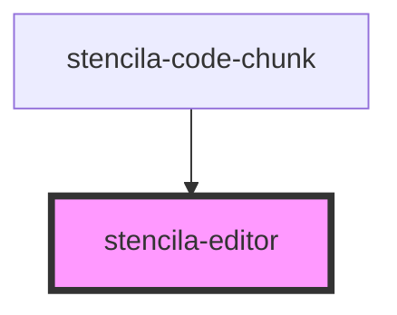

# stencila-editor

<!-- Auto Generated Below -->

## Properties

| Property               | Attribute         | Description                                               | Type                                             | Default                                                      |
| ---------------------- | ----------------- | --------------------------------------------------------- | ------------------------------------------------ | ------------------------------------------------------------ |
| `activeLanguage`       | `active-language` | Programming language of the Editor                        | `string`                                         | `this.languageCapabilities[0]?.toLowerCase() ?? ''`          |
| `executeHandler`       | --                | Function to be evaluated over the contents of the editor. | `(contents: EditorContents) => Promise<unknown>` | `undefined`                                                  |
| `keymap`               | --                | Custom keyboard shortcuts to pass along to CodeMirror     | `Keymap`                                         | `{}`                                                         |
| `languageCapabilities` | --                | List of all supported programming languages               | `string[]`                                       | `[     'Bash',     'JavaScript',     'R',     'Python',   ]` |
| `lineNumbers`          | `line-numbers`    | Determines the visibility of line numbers                 | `boolean`                                        | `true`                                                       |

## Methods

### `getContents() => Promise<EditorContents>`

Public method, returning the Editor contents and active language.

#### Returns

Type: `Promise<EditorContents>`

## Dependencies

### Used by

 - [stencila-code-chunk](../codeChunk)

### Graph

----------------------------------------------

*Built with [StencilJS](https://stenciljs.com/)*
