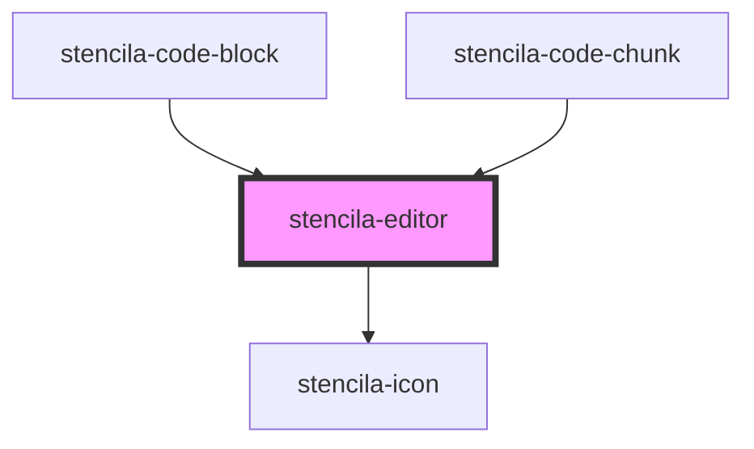

# stencila-editor

<!-- Auto Generated Below -->

## Properties

| Property               | Attribute         | Description                                                                | Type                                                             | Default                                               |
| ---------------------- | ----------------- | -------------------------------------------------------------------------- | ---------------------------------------------------------------- | ----------------------------------------------------- |
| `activeLanguage`       | `active-language` | Programming language of the Editor                                         | `string`                                                         | `this.languageCapabilities.R?.name ?? ''`             |
| `autofocus`            | `autofocus`       | Autofocus the editor on page load                                          | `boolean`                                                        | `false`                                               |
| `contentChangeHandler` | --                | Callback function to invoke whenever the editor contents are updated.      | `((updateEvent?: ViewUpdate \| undefined) => void) \| undefined` | `undefined`                                           |
| `contents`             | `contents`        | Text contents of the editor                                                | `string \| undefined`                                            | `undefined`                                           |
| `executableLanguages`  | --                | List of programming languages that can be executed in the current context  | `{ [x: string]: FileFormat; }`                                   | `window.stencilaWebClient?.executableLanguages ?? {}` |
| `executeHandler`       | --                | Function to be evaluated over the contents of the editor.                  | `((contents: EditorContents) => Promise<unknown>) \| undefined`  | `undefined`                                           |
| `foldGutter`           | `fold-gutter`     | Enables ability to fold sections of code if the syntax package supports it | `boolean`                                                        | `true`                                                |
| `keymap`               | --                | Custom keyboard shortcuts to pass along to CodeMirror                      | `KeyBinding[]`                                                   | `[]`                                                  |
| `languageCapabilities` | --                | List of all supported programming languages                                | `{ [x: string]: FileFormat; }`                                   | `fileFormatMap`                                       |
| `lineNumbers`          | `line-numbers`    | Determines the visibility of line numbers                                  | `boolean`                                                        | `true`                                                |
| `lineWrapping`         | `line-wrapping`   | Control line wrapping of text inside the editor                            | `boolean`                                                        | `false`                                               |
| `readOnly`             | `read-only`       | Disallow editing of the editor contents when set to `true`                 | `boolean`                                                        | `false`                                               |

## Events

| Event                      | Description                                               | Type                                                                     |
| -------------------------- | --------------------------------------------------------- | ------------------------------------------------------------------------ |
| `stencila-content-change`  | Event emitted when the content of the editor is changed.  | `CustomEvent<ViewUpdate>`                                                |
| `stencila-language-change` | Event emitted when the language of the editor is changed. | `CustomEvent<{ name: string; ext: string \| null; aliases: string[]; }>` |

## Methods

### `getContents() => Promise<EditorContents>`

Retrieve the Editor contents and active language.

#### Returns

Type: `Promise<EditorContents>`

### `getRef() => Promise<EditorView>`

Retrieve a reference to the internal CodeMirror editor.
Allows for maintaining state from applications making use of this component.

#### Returns

Type: `Promise<EditorView>`

### `getState() => Promise<EditorStateJSON>`

Retrieve a JSON representation of the the internal editor state.

#### Returns

Type: `Promise<EditorStateJSON>`

### `setContents(contents: string) => Promise<string>`

Replace the contents of the Editor with a supplied string.

#### Returns

Type: `Promise<string>`

### `setState(state: EditorStateJSON) => Promise<void>`

Update the internal editor state with the given JSON object.

#### Returns

Type: `Promise<void>`

### `setStateFromString(content: string) => Promise<void>`

Create a new editor state from a given string.
The string will be used as the initial contents of the editor.

#### Returns

Type: `Promise<void>`

## Slots

| Slot       | Description                                                               |
| ---------- | ------------------------------------------------------------------------- |
| `"errors"` | List of any `stencila-code-error` elements to render in the Errors panel. |
| `"text"`   | The contents of the editor.                                               |

## CSS Custom Properties

| Name                  | Description                                                              |
| --------------------- | ------------------------------------------------------------------------ |
| `--gutter-background` | Background color of the Editor gutter (Line numbers, fold, etc)          |
| `--gutter-color`      | (Text) Color of the Editor Line Numbers gutter (Line numbers, fold, etc) |

## Dependencies

### Used by

 - [stencila-code-block](../codeBlock)
 - [stencila-code-chunk](../codeChunk)

### Depends on

- [stencila-icon](../icon)

### Graph

----------------------------------------------

*Built with [StencilJS](https://stenciljs.com/)*
