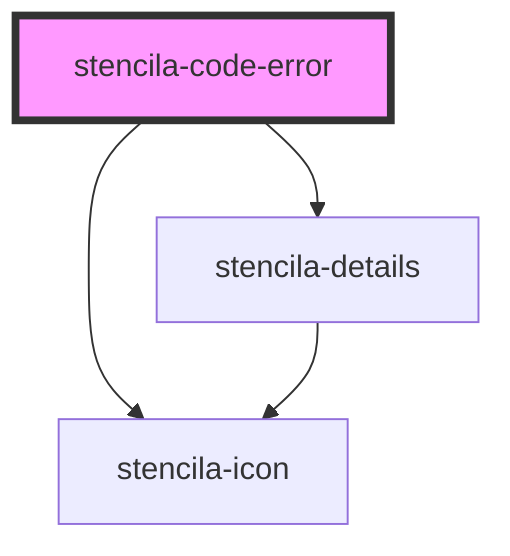

# stencila-error

<!-- Auto Generated Below -->

## Properties

| Property | Attribute | Description                       | Type                                                                                                                                    | Default     |
| -------- | --------- | --------------------------------- | --------------------------------------------------------------------------------------------------------------------------------------- | ----------- |
| `error`  | --        | The `CodeError` node              | `Entity & { type: "CodeError"; errorMessage: string; errorType?: string \| undefined; stackTrace?: string \| undefined; } \| undefined` | `undefined` |
| `level`  | `level`   | The severity of the error message | `"error" \| "info" \| "warn" \| undefined`                                                                                              | `undefined` |

## Dependencies

### Depends on

- [stencila-icon](../icon)
- [stencila-details](../details)

### Graph

----------------------------------------------

*Built with [StencilJS](https://stenciljs.com/)*
