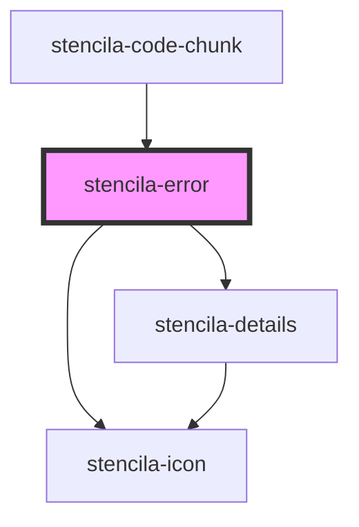

# stencila-button

<!-- Auto Generated Below -->

## Properties

| Property        | Attribute        | Description | Type                                  | Default     |
| --------------- | ---------------- | ----------- | ------------------------------------- | ----------- |
| `hasStacktrace` | `has-stacktrace` |             | `boolean`                             | `undefined` |
| `kind`          | `kind`           |             | `"error" \| "incapable" \| "warning"` | `'warning'` |
| `open`          | `open`           |             | `boolean`                             | `false`     |

## Dependencies

### Used by

 - [stencila-code-chunk](../codeChunk)

### Depends on

- [stencila-icon](../icon)
- [stencila-details](../details)

### Graph

----------------------------------------------

*Built with [StencilJS](https://stenciljs.com/)*
