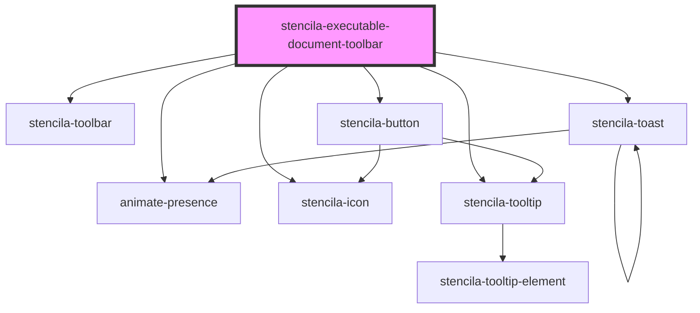

# stencila-executable-document-toolbar

<!-- Auto Generated Below -->

## Properties

| Property             | Attribute              | Description                                                                                                                                                                                                                   | Type                  | Default     |
| -------------------- | ---------------------- | ----------------------------------------------------------------------------------------------------------------------------------------------------------------------------------------------------------------------------- | --------------------- | ----------- |
| `position`           | `position`             | When `fixed` the Navbar will remain pinned to the top of the screen. Note that if the Navbar component is not followed by a sibling element, you will have to set `margin-top: 3rem` on the following element yourself.       | `"fixed" \| "static"` | `'fixed'`   |
| `sessionProviderUrl` | `session-provider-url` | The URL for requesting a SoftwareSession as defined in Stencila Schema. Passed to Stencila Executa for instantiating the session. TODO: If undefined user should be able to set one themselves (e.g. running a local machine) | `string`              | `undefined` |
| `sourceUrl`          | `source-url`           | The URL of the document being decorated. Could be a Snapshot from Stencila Hub, a Project URL, or something else.                                                                                                             | `string`              | `undefined` |

## CSS Custom Properties

| Name           | Description                                 |
| -------------- | ------------------------------------------- |
| `--background` | Sets the background color of the component. |

## Dependencies

### Depends on

- [stencila-toolbar](../toolbar)
- [stencila-button](../button)
- animate-presence
- [stencila-toast](../toast)
- [stencila-icon](../icon)
- [stencila-tooltip](../tooltip)

### Graph

----------------------------------------------

*Built with [StencilJS](https://stenciljs.com/)*
