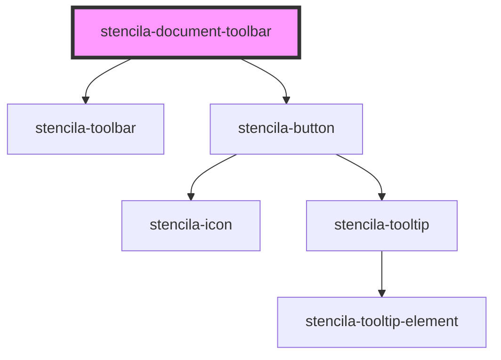

# stencila-document-toolbar

<!-- Auto Generated Below -->

## Properties

| Property        | Attribute        | Description                                                                                                                                                                                                             | Type                                                                                                                                          | Default     |
| --------------- | ---------------- | ----------------------------------------------------------------------------------------------------------------------------------------------------------------------------------------------------------------------- | --------------------------------------------------------------------------------------------------------------------------------------------- | ----------- |
| `executeStatus` | `execute-status` | The execution status of the document                                                                                                                                                                                    | `"Cancelled" \| "Failed" \| "Running" \| "RunningPreviouslyFailed" \| "Scheduled" \| "ScheduledPreviouslyFailed" \| "Succeeded" \| undefined` | `undefined` |
| `position`      | `position`       | When `fixed` the Navbar will remain pinned to the top of the screen. Note that if the Navbar component is not followed by a sibling element, you will have to set `margin-top: 3rem` on the following element yourself. | `"fixed" \| "static"`                                                                                                                         | `'fixed'`   |
| `sourceUrl`     | `source-url`     | The URL of the document being decorated. Could be a Snapshot from Stencila Hub, a Project URL, or something else.                                                                                                       | `string`                                                                                                                                      | `undefined` |

## Events

| Event                          | Description                                                                              | Type                                                                                            |
| ------------------------------ | ---------------------------------------------------------------------------------------- | ----------------------------------------------------------------------------------------------- |
| `stencila-code-execute`        | Emitted to indicate that code node should be executed                                    | `CustomEvent<{ nodeId: string \| null; ordering: "Single" \| "Appearance" \| "Topological"; }>` |
| `stencila-code-execute-cancel` | Emitted to indicate that the execution of the code node should be cancelled/interrupted. | `CustomEvent<{ nodeId: string \| null; scope: "Single" \| "All"; }>`                            |
| `stencila-kernel-restart`      | Emitted to indicate that language kernels should be restarted                            | `CustomEvent<{}>`                                                                               |

## CSS Custom Properties

| Name           | Description                                 |
| -------------- | ------------------------------------------- |
| `--background` | Sets the background color of the component. |

## Dependencies

### Depends on

- [stencila-toolbar](../toolbar)
- [stencila-button](../button)

### Graph

----------------------------------------------

*Built with [StencilJS](https://stenciljs.com/)*
