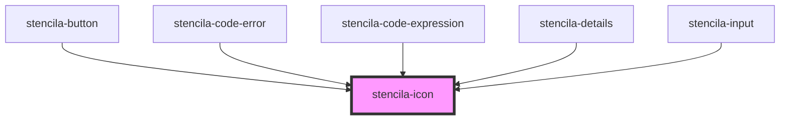

# stencila-icon

<!-- Auto Generated Below -->

## Properties

| Property | Attribute | Description | Type                                                                                                                                                                                                                                                                                                                                                                                                                                                                                                                                                                                                                                                                                                                                                                                                                                                                                                                                                                                                                                                                                                                                                                                                                                                                                                                                                                                                                                                                                                                                                                                                                                                                                                                                                                                                                                                                                                                                                                                                                                                                                                                                                                                                                                                                                                                                                                                                                                                                                                                                                                                                                                                                                                                                                                                                                                                                                                                                                                                                                                                                                                                                                                                                                                                                                                                                                                                                                                                                                                                                                                                                                                                                                                                                                                                                                                                                                                                                                                                                                                                                                                                                                                       | Default     |
| -------- | --------- | ----------- | -------------------------------------------------------------------------------------------------------------------------------------------------------------------------------------------------------------------------------------------------------------------------------------------------------------------------------------------------------------------------------------------------------------------------------------------------------------------------------------------------------------------------------------------------------------------------------------------------------------------------------------------------------------------------------------------------------------------------------------------------------------------------------------------------------------------------------------------------------------------------------------------------------------------------------------------------------------------------------------------------------------------------------------------------------------------------------------------------------------------------------------------------------------------------------------------------------------------------------------------------------------------------------------------------------------------------------------------------------------------------------------------------------------------------------------------------------------------------------------------------------------------------------------------------------------------------------------------------------------------------------------------------------------------------------------------------------------------------------------------------------------------------------------------------------------------------------------------------------------------------------------------------------------------------------------------------------------------------------------------------------------------------------------------------------------------------------------------------------------------------------------------------------------------------------------------------------------------------------------------------------------------------------------------------------------------------------------------------------------------------------------------------------------------------------------------------------------------------------------------------------------------------------------------------------------------------------------------------------------------------------------------------------------------------------------------------------------------------------------------------------------------------------------------------------------------------------------------------------------------------------------------------------------------------------------------------------------------------------------------------------------------------------------------------------------------------------------------------------------------------------------------------------------------------------------------------------------------------------------------------------------------------------------------------------------------------------------------------------------------------------------------------------------------------------------------------------------------------------------------------------------------------------------------------------------------------------------------------------------------------------------------------------------------------------------------------------------------------------------------------------------------------------------------------------------------------------------------------------------------------------------------------------------------------------------------------------------------------------------------------------------------------------------------------------------------------------------------------------------------------------------------------------------------------- | ----------- |
| `icon`   | `icon`    |             | `"target" or "key" or "activity" or "airplay" or "alert-circle" or "alert-octagon" or "alert-triangle" or "align-center" or "align-justify" or "align-left" or "align-right" or "anchor" or "aperture" or "archive" or "arrow-down-circle" or "arrow-down-left" or "arrow-down-right" or "arrow-down" or "arrow-left-circle" or "arrow-left" or "arrow-right-circle" or "arrow-right" or "arrow-up-circle" or "arrow-up-left" or "arrow-up-right" or "arrow-up" or "at-sign" or "award" or "bar-chart-2" or "bar-chart" or "battery-charging" or "battery" or "bell-off" or "bell" or "bluetooth" or "bold" or "book-open" or "book" or "bookmark" or "box" or "briefcase" or "calendar" or "camera-off" or "camera" or "cast" or "check-circle" or "check-square" or "check" or "chevron-down" or "chevron-left" or "chevron-right" or "chevron-up" or "chevrons-down" or "chevrons-left" or "chevrons-right" or "chevrons-up" or "chrome" or "circle" or "clipboard" or "clock" or "cloud-drizzle" or "cloud-lightning" or "cloud-off" or "cloud-rain" or "cloud-snow" or "cloud" or "code" or "codepen" or "codesandbox" or "coffee" or "columns" or "command" or "compass" or "copy" or "corner-down-left" or "corner-down-right" or "corner-left-down" or "corner-left-up" or "corner-right-down" or "corner-right-up" or "corner-up-left" or "corner-up-right" or "cpu" or "credit-card" or "crop" or "crosshair" or "database" or "delete" or "disc" or "dollar-sign" or "download-cloud" or "download" or "droplet" or "edit-2" or "edit-3" or "edit" or "external-link" or "eye-off" or "eye" or "facebook" or "fast-forward" or "feather" or "figma" or "file-minus" or "file-plus" or "file-text" or "file" or "film" or "filter" or "flag" or "folder-minus" or "folder-plus" or "folder" or "framer" or "frown" or "gift" or "git-branch" or "git-commit" or "git-merge" or "git-pull-request" or "github" or "gitlab" or "globe" or "grid" or "hard-drive" or "hash" or "headphones" or "heart" or "help-circle" or "hexagon" or "home" or "image" or "inbox" or "info" or "instagram" or "italic" or "layers" or "layout" or "life-buoy" or "link-2" or "link" or "linkedin" or "list" or "loader" or "lock" or "log-in" or "log-out" or "mail" or "map-pin" or "map" or "maximize-2" or "maximize" or "meh" or "menu" or "message-circle" or "message-square" or "mic-off" or "mic" or "minimize-2" or "minimize" or "minus-circle" or "minus-square" or "minus" or "monitor" or "moon" or "more-horizontal" or "more-vertical" or "mouse-pointer" or "move" or "music" or "navigation-2" or "navigation" or "octagon" or "package" or "paperclip" or "pause-circle" or "pause" or "pen-tool" or "percent" or "phone-call" or "phone-forwarded" or "phone-incoming" or "phone-missed" or "phone-off" or "phone-outgoing" or "phone" or "pie-chart" or "play-circle" or "play" or "plus-circle" or "plus-square" or "plus" or "pocket" or "power" or "printer" or "radio" or "refresh-ccw" or "refresh-cw" or "repeat" or "rewind" or "rotate-ccw" or "rotate-cw" or "rss" or "save" or "scissors" or "search" or "send" or "server" or "settings" or "share-2" or "share" or "shield-off" or "shield" or "shopping-bag" or "shopping-cart" or "shuffle" or "sidebar" or "skip-back" or "skip-forward" or "slack" or "slash" or "sliders" or "smartphone" or "smile" or "speaker" or "square" or "star" or "stop-circle" or "sun" or "sunrise" or "sunset" or "tablet" or "tag" or "terminal" or "thermometer" or "thumbs-down" or "thumbs-up" or "toggle-left" or "toggle-right" or "tool" or "trash-2" or "trash" or "trello" or "trending-down" or "trending-up" or "triangle" or "truck" or "tv" or "twitch" or "twitter" or "type" or "umbrella" or "underline" or "unlock" or "upload-cloud" or "upload" or "user-check" or "user-minus" or "user-plus" or "user-x" or "user" or "users" or "video-off" or "video" or "voicemail" or "volume-1" or "volume-2" or "volume-x" or "volume" or "watch" or "wifi-off" or "wifi" or "wind" or "x-circle" or "x-octagon" or "x-square" or "x" or "youtube" or "zap-off" or "zap" or "zoom-in" or "zoom-out"` | `undefined` |

## Dependencies

### Used by

 - [stencila-button](../button)
 - [stencila-code-error](../error)
 - [stencila-code-expression](../codeExpression)
 - [stencila-details](../details)
 - [stencila-input](../input)

### Graph

----------------------------------------------

*Built with [StencilJS](https://stenciljs.com/)*
