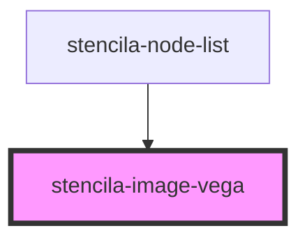

# stencila-image-vega

<!-- Auto Generated Below -->

## Properties

| Property  | Attribute | Description                                          | Type                                                                                                                                                                                                                                                                                                                                                                                                                                                                                                                                                                                                                                                                                                                                                                                                                                                                                                                                                                                                                                                                                                                                                                                                                                                                                                                                                                                                                                                                                                                                                                                                                                                                                                                                                                                                                                                                                                                                                                                                                                                                                                                                                                                                                                                                                                                                                                                                                                                                                                                                                                                                   | Default     |
| --------- | --------- | ---------------------------------------------------- | ------------------------------------------------------------------------------------------------------------------------------------------------------------------------------------------------------------------------------------------------------------------------------------------------------------------------------------------------------------------------------------------------------------------------------------------------------------------------------------------------------------------------------------------------------------------------------------------------------------------------------------------------------------------------------------------------------------------------------------------------------------------------------------------------------------------------------------------------------------------------------------------------------------------------------------------------------------------------------------------------------------------------------------------------------------------------------------------------------------------------------------------------------------------------------------------------------------------------------------------------------------------------------------------------------------------------------------------------------------------------------------------------------------------------------------------------------------------------------------------------------------------------------------------------------------------------------------------------------------------------------------------------------------------------------------------------------------------------------------------------------------------------------------------------------------------------------------------------------------------------------------------------------------------------------------------------------------------------------------------------------------------------------------------------------------------------------------------------------------------------------------------------------------------------------------------------------------------------------------------------------------------------------------------------------------------------------------------------------------------------------------------------------------------------------------------------------------------------------------------------------------------------------------------------------------------------------------------------------ | ----------- |
| `options` | --        | A JavaScript object containing options for embedding | `undefined \| ({ bind?: string \| HTMLElement \| undefined; actions?: boolean \| Actions \| undefined; mode?: "vega" \| "vega-lite" \| undefined; theme?: "excel" \| "ggplot2" \| "quartz" \| "vox" \| "dark" \| undefined; defaultStyle?: string \| boolean \| undefined; logLevel?: number \| undefined; loader?: Loader \| LoaderOptions \| undefined; renderer?: "canvas" \| "svg" \| "none" \| undefined; tooltip?: boolean \| TooltipHandler \| Partial<{ offsetX: number; offsetY: number; id: string; styleId: string; theme: string; disableDefaultStyle: boolean; sanitize: (value: any) => string; maxDepth: number; }> \| undefined; patch?: string \| PatchFunc \| Operation[] \| undefined; width?: number \| undefined; height?: number \| undefined; padding?: number \| { left?: number \| undefined; right?: number \| undefined; top?: number \| undefined; bottom?: number \| undefined; } \| undefined; scaleFactor?: number \| undefined; config?: string \| import("/Users/ketch/Work/Stencila/designa/packages/components/node_modules/vega-lite/build/src/config").Config<import("/Users/ketch/Work/Stencila/designa/packages/components/node_modules/vega-lite/build/src/expr").ExprRef \| import("/Users/ketch/Work/Stencila/designa/packages/components/node_modules/vega-typings/types/spec/signal").SignalRef> \| import("/Users/ketch/Work/Stencila/designa/packages/components/node_modules/vega-typings/types/spec/config").Config \| undefined; sourceHeader?: string \| undefined; sourceFooter?: string \| undefined; editorUrl?: string \| undefined; hover?: boolean \| Hover \| undefined; i18n?: Partial<{ CLICK_TO_VIEW_ACTIONS: string; COMPILED_ACTION: string; EDITOR_ACTION: string; PNG_ACTION: string; SOURCE_ACTION: string; SVG_ACTION: string; }> \| undefined; downloadFileName?: string \| undefined; formatLocale?: Record<string, unknown> \| undefined; timeFormatLocale?: Record<string, unknown> \| undefined; ast?: boolean \| undefined; })`                                                                                                                                                                                                                                                                                                                                                                                                                                                                                                                                                                                                | `undefined` |
| `spec`    | `spec`    | The Vega or Vega-Lite spec @see                      | `GenericConcatSpec<GenericSpec<FacetedUnitSpec<Field>, LayerSpec<Field>, RepeatSpec, Field>> & TopLevelProperties<ExprRef \| SignalRef> & { $schema?: string \| undefined; config?: Config<ExprRef \| SignalRef> \| undefined; datasets?: Record<string, InlineDataset> \| undefined; usermeta?: Record<string, unknown> \| undefined; } \| GenericFacetSpec<UnitSpecWithFrame<Field>, LayerSpec<Field>, Field> & TopLevelProperties<ExprRef \| SignalRef> & { $schema?: string \| undefined; config?: Config<ExprRef \| SignalRef> \| undefined; datasets?: Record<string, InlineDataset> \| undefined; usermeta?: Record<string, unknown> \| undefined; } & DataMixins \| GenericHConcatSpec<GenericSpec<FacetedUnitSpec<Field>, LayerSpec<Field>, RepeatSpec, Field>> & TopLevelProperties<ExprRef \| SignalRef> & { $schema?: string \| undefined; config?: Config<ExprRef \| SignalRef> \| undefined; datasets?: Record<string, InlineDataset> \| undefined; usermeta?: Record<string, unknown> \| undefined; } \| GenericUnitSpec<FacetedCompositeEncoding<Field>, AnyMark> & ResolveMixins & GenericCompositionLayout & FrameMixins<ExprRef \| SignalRef> & TopLevelProperties<ExprRef \| SignalRef> & { $schema?: string \| undefined; config?: Config<ExprRef \| SignalRef> \| undefined; datasets?: Record<string, InlineDataset> \| undefined; usermeta?: Record<string, unknown> \| undefined; } & DataMixins \| GenericVConcatSpec<GenericSpec<FacetedUnitSpec<Field>, LayerSpec<Field>, RepeatSpec, Field>> & TopLevelProperties<ExprRef \| SignalRef> & { $schema?: string \| undefined; config?: Config<ExprRef \| SignalRef> \| undefined; datasets?: Record<string, InlineDataset> \| undefined; usermeta?: Record<string, unknown> \| undefined; } \| LayerRepeatSpec & TopLevelProperties<ExprRef \| SignalRef> & { $schema?: string \| undefined; config?: Config<ExprRef \| SignalRef> \| undefined; datasets?: Record<string, InlineDataset> \| undefined; usermeta?: Record<string, unknown> \| undefined; } \| LayerSpec<Field> & TopLevelProperties<ExprRef \| SignalRef> & { $schema?: string \| undefined; config?: Config<ExprRef \| SignalRef> \| undefined; datasets?: Record<string, InlineDataset> \| undefined; usermeta?: Record<string, unknown> \| undefined; } \| NonLayerRepeatSpec & TopLevelProperties<ExprRef \| SignalRef> & { $schema?: string \| undefined; config?: Config<ExprRef \| SignalRef> \| undefined; datasets?: Record<string, InlineDataset> \| undefined; usermeta?: Record<string, unknown> \| undefined; } \| Spec \| string \| undefined` | `undefined` |

## Events

| Event        | Description                                                                          | Type                              |
| ------------ | ------------------------------------------------------------------------------------ | --------------------------------- |
| `vegaLoaded` | Custom event emitter to indicate that the loading of the Vega JS script has finished | `CustomEvent<{ library: Mode; }>` |

## Dependencies

### Used by

 - [stencila-node-list](../../nodeList)

### Graph

----------------------------------------------

*Built with [StencilJS](https://stenciljs.com/)*
