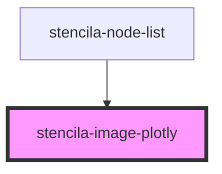

# stencila-image-plotly

<!-- Auto Generated Below -->

## Properties

| Property | Attribute | Description                                                | Type                                                                                                                                                                                                                                                                                                                                                                                                                                                                                                                                                                                                                                                                                                                                                                                                                                                                                                                                                                                                                                                                                                                                                                                                                                                                                                                                                                                                                                                                                                                                                                                                                                                                                                                                                                                                                                                                                                                                                                                                                                                                                                                                                                                                                                                                                                                                                                                                                                                                                                                                                                                                                                                                                                                                                                                                                                                                                                                                                                                                                                                                                                                                                                                                                                                                                                                                                                                                                                                                                                                                                                                                                                                                                                                                                                                                                                                                                                                                                                                                                                                                                                                                                                                                                                                                                                                                                                                                                                                                                                                                                                                                                                                                                                                                                                                                                                                                 | Default     |
| -------- | --------- | ---------------------------------------------------------- | -------------------------------------------------------------------------------------------------------------------------------------------------------------------------------------------------------------------------------------------------------------------------------------------------------------------------------------------------------------------------------------------------------------------------------------------------------------------------------------------------------------------------------------------------------------------------------------------------------------------------------------------------------------------------------------------------------------------------------------------------------------------------------------------------------------------------------------------------------------------------------------------------------------------------------------------------------------------------------------------------------------------------------------------------------------------------------------------------------------------------------------------------------------------------------------------------------------------------------------------------------------------------------------------------------------------------------------------------------------------------------------------------------------------------------------------------------------------------------------------------------------------------------------------------------------------------------------------------------------------------------------------------------------------------------------------------------------------------------------------------------------------------------------------------------------------------------------------------------------------------------------------------------------------------------------------------------------------------------------------------------------------------------------------------------------------------------------------------------------------------------------------------------------------------------------------------------------------------------------------------------------------------------------------------------------------------------------------------------------------------------------------------------------------------------------------------------------------------------------------------------------------------------------------------------------------------------------------------------------------------------------------------------------------------------------------------------------------------------------------------------------------------------------------------------------------------------------------------------------------------------------------------------------------------------------------------------------------------------------------------------------------------------------------------------------------------------------------------------------------------------------------------------------------------------------------------------------------------------------------------------------------------------------------------------------------------------------------------------------------------------------------------------------------------------------------------------------------------------------------------------------------------------------------------------------------------------------------------------------------------------------------------------------------------------------------------------------------------------------------------------------------------------------------------------------------------------------------------------------------------------------------------------------------------------------------------------------------------------------------------------------------------------------------------------------------------------------------------------------------------------------------------------------------------------------------------------------------------------------------------------------------------------------------------------------------------------------------------------------------------------------------------------------------------------------------------------------------------------------------------------------------------------------------------------------------------------------------------------------------------------------------------------------------------------------------------------------------------------------------------------------------------------------------------------------------------------------------------------------------- | ----------- |
| `config` | --        | The Plotly configuration object                            | `undefined \| ({ toImageButtonOptions?: Partial<{ filename: string; scale: number; format: "png" \| "svg" \| "jpeg" \| "webp"; height: number; width: number; }> \| undefined; staticPlot?: boolean \| undefined; plotlyServerURL?: string \| undefined; editable?: boolean \| undefined; edits?: Partial<Edits> \| undefined; autosizable?: boolean \| undefined; queueLength?: number \| undefined; fillFrame?: boolean \| undefined; frameMargins?: number \| undefined; scrollZoom?: boolean \| undefined; doubleClick?: false \| "reset" \| "autosize" \| "reset+autosize" \| undefined; showTips?: boolean \| undefined; showAxisDragHandles?: boolean \| undefined; showAxisRangeEntryBoxes?: boolean \| undefined; showLink?: boolean \| undefined; sendData?: boolean \| undefined; linkText?: string \| undefined; showSources?: boolean \| undefined; displayModeBar?: boolean \| "hover" \| undefined; showSendToCloud?: boolean \| undefined; showEditInChartStudio?: boolean \| undefined; modeBarButtonsToRemove?: ModeBarDefaultButtons[] \| undefined; modeBarButtonsToAdd?: ModeBarDefaultButtons[] \| ModeBarButton[] \| undefined; modeBarButtons?: false \| (ModeBarDefaultButtons[] \| ModeBarButton[])[] \| undefined; displaylogo?: boolean \| undefined; plotGlPixelRatio?: number \| undefined; setBackground?: (() => string) \| undefined; topojsonURL?: string \| undefined; mapboxAccessToken?: string \| undefined; logging?: boolean \| 0 \| 2 \| 1 \| undefined; globalTransforms?: any[] \| undefined; locale?: string \| undefined; responsive?: boolean \| undefined; })`                                                                                                                                                                                                                                                                                                                                                                                                                                                                                                                                                                                                                                                                                                                                                                                                                                                                                                                                                                                                                                                                                                                                                                                                                                                                                                                                                                                                                                                                                                                                                                                                                                                                                                                                                                                                                                                                                                                                                                                                                                                                                                                                                                                                                                                                                                                                                                                                                                                                                                                                                                                                                                                                                                                                                                                                                                                                                                                                                                                                                                                                                                                                                                                                                                                        | `undefined` |
| `data`   | --        | The Plotly data to render as an interactive visualization. | `Data[] \| undefined`                                                                                                                                                                                                                                                                                                                                                                                                                                                                                                                                                                                                                                                                                                                                                                                                                                                                                                                                                                                                                                                                                                                                                                                                                                                                                                                                                                                                                                                                                                                                                                                                                                                                                                                                                                                                                                                                                                                                                                                                                                                                                                                                                                                                                                                                                                                                                                                                                                                                                                                                                                                                                                                                                                                                                                                                                                                                                                                                                                                                                                                                                                                                                                                                                                                                                                                                                                                                                                                                                                                                                                                                                                                                                                                                                                                                                                                                                                                                                                                                                                                                                                                                                                                                                                                                                                                                                                                                                                                                                                                                                                                                                                                                                                                                                                                                                                                | `undefined` |
| `layout` | --        | The Plotly layout settings object                          | `undefined \| { colorway?: string[] \| undefined; title?: string \| Partial<{ text: string; font: Partial; xref: "container" \| "paper"; yref: "container" \| "paper"; x: number; y: number; xanchor: "auto" \| "left" \| "center" \| "right"; yanchor: "auto" \| "top" \| "middle" \| "bottom"; pad: Partial<Padding>; }> \| undefined; titlefont?: Partial \| undefined; autosize?: boolean \| undefined; showlegend?: boolean \| undefined; paper_bgcolor?: string \| number \| (string \| number \| null \| undefined)[] \| (string \| number \| null \| undefined)[][] \| undefined; plot_bgcolor?: string \| number \| (string \| number \| null \| undefined)[] \| (string \| number \| null \| undefined)[][] \| undefined; separators?: string \| undefined; hidesources?: boolean \| undefined; xaxis?: Partial<LayoutAxis> \| undefined; xaxis2?: Partial<LayoutAxis> \| undefined; xaxis3?: Partial<LayoutAxis> \| undefined; xaxis4?: Partial<LayoutAxis> \| undefined; xaxis5?: Partial<LayoutAxis> \| undefined; xaxis6?: Partial<LayoutAxis> \| undefined; xaxis7?: Partial<LayoutAxis> \| undefined; xaxis8?: Partial<LayoutAxis> \| undefined; xaxis9?: Partial<LayoutAxis> \| undefined; yaxis?: Partial<LayoutAxis> \| undefined; yaxis2?: Partial<LayoutAxis> \| undefined; yaxis3?: Partial<LayoutAxis> \| undefined; yaxis4?: Partial<LayoutAxis> \| undefined; yaxis5?: Partial<LayoutAxis> \| undefined; yaxis6?: Partial<LayoutAxis> \| undefined; yaxis7?: Partial<LayoutAxis> \| undefined; yaxis8?: Partial<LayoutAxis> \| undefined; yaxis9?: Partial<LayoutAxis> \| undefined; margin?: Partial<Margin> \| undefined; height?: number \| undefined; width?: number \| undefined; hovermode?: false \| "closest" \| "x" \| "y" \| "x unified" \| "y unified" \| undefined; hoverdistance?: number \| undefined; hoverlabel?: Partial<HoverLabel> \| undefined; calendar?: "gregorian" \| "chinese" \| "coptic" \| "discworld" \| "ethiopian" \| "hebrew" \| "islamic" \| "julian" \| "mayan" \| "nanakshahi" \| "nepali" \| "persian" \| "jalali" \| "taiwan" \| "thai" \| "ummalqura" \| undefined; 'xaxis.range'?: [Datum, Datum] \| undefined; 'xaxis.range[0]'?: string \| number \| Date \| null \| undefined; 'xaxis.range[1]'?: string \| number \| Date \| null \| undefined; 'yaxis.range'?: [Datum, Datum] \| undefined; 'yaxis.range[0]'?: string \| number \| Date \| null \| undefined; 'yaxis.range[1]'?: string \| number \| Date \| null \| undefined; 'yaxis.type'?: "-" \| "linear" \| "log" \| "date" \| "category" \| "multicategory" \| undefined; 'xaxis.type'?: "-" \| "linear" \| "log" \| "date" \| "category" \| "multicategory" \| undefined; 'xaxis.autorange'?: boolean \| undefined; 'yaxis.autorange'?: boolean \| undefined; 'xaxis.title'?: string \| undefined; 'yaxis.title'?: string \| undefined; ternary?: {} \| undefined; geo?: {} \| undefined; mapbox?: Partial<Mapbox> \| undefined; subplot?: string \| undefined; radialaxis?: Partial<Axis> \| undefined; angularaxis?: {} \| undefined; dragmode?: false \| "zoom" \| "pan" \| "select" \| "lasso" \| "orbit" \| "turntable" \| undefined; orientation?: number \| undefined; annotations?: Partial<Annotations>[] \| undefined; shapes?: Partial<Shape>[] \| undefined; images?: Partial<Image>[] \| undefined; updatemenus?: {} \| undefined; sliders?: Partial<Slider>[] \| undefined; legend?: Partial<Legend> \| undefined; font?: Partial \| undefined; scene?: Partial<Scene> \| undefined; barmode?: "group" \| "stack" \| "overlay" \| "relative" \| undefined; barnorm?: "" \| "percent" \| "fraction" \| undefined; bargap?: number \| undefined; bargroupgap?: number \| undefined; boxmode?: "group" \| "overlay" \| undefined; selectdirection?: "h" \| "v" \| "d" \| "any" \| undefined; hiddenlabels?: string[] \| undefined; grid?: Partial<{ rows: number; roworder: "top to bottom" \| "bottom to top"; columns: number; subplots: string[]; xaxes: string[]; yaxes: string[]; pattern: "independent" \| "coupled"; xgap: number; ygap: number; domain: Partial<{ x: number[]; y: number[]; }>; xside: "top" \| "bottom" \| "bottom plot" \| "top plot"; yside: "left" \| "right" \| "left plot" \| "right plot"; }> \| undefined; polar?: Partial<PolarLayout> \| undefined; polar2?: Partial<PolarLayout> \| undefined; polar3?: Partial<PolarLayout> \| undefined; polar4?: Partial<PolarLayout> \| undefined; polar5?: Partial<PolarLayout> \| undefined; polar6?: Partial<PolarLayout> \| undefined; polar7?: Partial<PolarLayout> \| undefined; polar8?: Partial<PolarLayout> \| undefined; polar9?: Partial<PolarLayout> \| undefined; transition?: Transition \| undefined; template?: Template \| undefined; clickmode?: "select" \| "event" \| "event+select" \| "none" \| undefined; }` | `undefined` |

## Events

| Event          | Description                                                                            | Type               |
| -------------- | -------------------------------------------------------------------------------------- | ------------------ |
| `plotlyLoaded` | Custom event emitter to indicate that the loading of the Plotly.js script has finished | `CustomEvent<any>` |

## Dependencies

### Used by

 - [stencila-node-list](../../nodeList)

### Graph

----------------------------------------------

*Built with [StencilJS](https://stenciljs.com/)*
