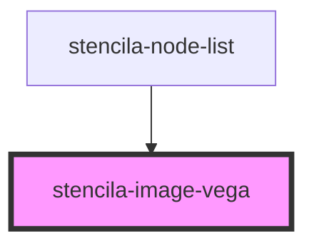

# stencila-image-vega

<!-- Auto Generated Below -->

## Properties

| Property  | Attribute | Description                                          | Type                                                                                                                                                                                                                                                                                                                                                                                                                                                                                                                                                                                                                                                                                                                                                                                                                                                                                                                                                                                                                                                                                                                                                                                                                                                                                                                                                                                                                                                                                                                                                                                                                                                                                                                                                                                                                                                                                                                                                                                                                                                                                                                                                                                                                                                                                                                                                                                                                                                                                                                                                                                                   | Default     |
| --------- | --------- | ---------------------------------------------------- | ------------------------------------------------------------------------------------------------------------------------------------------------------------------------------------------------------------------------------------------------------------------------------------------------------------------------------------------------------------------------------------------------------------------------------------------------------------------------------------------------------------------------------------------------------------------------------------------------------------------------------------------------------------------------------------------------------------------------------------------------------------------------------------------------------------------------------------------------------------------------------------------------------------------------------------------------------------------------------------------------------------------------------------------------------------------------------------------------------------------------------------------------------------------------------------------------------------------------------------------------------------------------------------------------------------------------------------------------------------------------------------------------------------------------------------------------------------------------------------------------------------------------------------------------------------------------------------------------------------------------------------------------------------------------------------------------------------------------------------------------------------------------------------------------------------------------------------------------------------------------------------------------------------------------------------------------------------------------------------------------------------------------------------------------------------------------------------------------------------------------------------------------------------------------------------------------------------------------------------------------------------------------------------------------------------------------------------------------------------------------------------------------------------------------------------------------------------------------------------------------------------------------------------------------------------------------------------------------------ | ----------- |
| `options` | --        | A JavaScript object containing options for embedding | `undefined \| { [x: string]: unknown; }`                                                                                                                                                                                                                                                                                                                                                                                                                                                                                                                                                                                                                                                                                                                                                                                                                                                                                                                                                                                                                                                                                                                                                                                                                                                                                                                                                                                                                                                                                                                                                                                                                                                                                                                                                                                                                                                                                                                                                                                                                                                                                                                                                                                                                                                                                                                                                                                                                                                                                                                                                               | `{}`        |
| `spec`    | `spec`    | The Vega or Vega-Lite spec                           | `GenericConcatSpec<GenericSpec<FacetedUnitSpec<Field>, LayerSpec<Field>, RepeatSpec, Field>> & TopLevelProperties<ExprRef \| SignalRef> & { $schema?: string \| undefined; config?: Config<ExprRef \| SignalRef> \| undefined; datasets?: Record<string, InlineDataset> \| undefined; usermeta?: Record<string, unknown> \| undefined; } \| GenericFacetSpec<UnitSpecWithFrame<Field>, LayerSpec<Field>, Field> & TopLevelProperties<ExprRef \| SignalRef> & { $schema?: string \| undefined; config?: Config<ExprRef \| SignalRef> \| undefined; datasets?: Record<string, InlineDataset> \| undefined; usermeta?: Record<string, unknown> \| undefined; } & DataMixins \| GenericHConcatSpec<GenericSpec<FacetedUnitSpec<Field>, LayerSpec<Field>, RepeatSpec, Field>> & TopLevelProperties<ExprRef \| SignalRef> & { $schema?: string \| undefined; config?: Config<ExprRef \| SignalRef> \| undefined; datasets?: Record<string, InlineDataset> \| undefined; usermeta?: Record<string, unknown> \| undefined; } \| GenericUnitSpec<FacetedCompositeEncoding<Field>, AnyMark> & ResolveMixins & GenericCompositionLayout & FrameMixins<ExprRef \| SignalRef> & TopLevelProperties<ExprRef \| SignalRef> & { $schema?: string \| undefined; config?: Config<ExprRef \| SignalRef> \| undefined; datasets?: Record<string, InlineDataset> \| undefined; usermeta?: Record<string, unknown> \| undefined; } & DataMixins \| GenericVConcatSpec<GenericSpec<FacetedUnitSpec<Field>, LayerSpec<Field>, RepeatSpec, Field>> & TopLevelProperties<ExprRef \| SignalRef> & { $schema?: string \| undefined; config?: Config<ExprRef \| SignalRef> \| undefined; datasets?: Record<string, InlineDataset> \| undefined; usermeta?: Record<string, unknown> \| undefined; } \| LayerRepeatSpec & TopLevelProperties<ExprRef \| SignalRef> & { $schema?: string \| undefined; config?: Config<ExprRef \| SignalRef> \| undefined; datasets?: Record<string, InlineDataset> \| undefined; usermeta?: Record<string, unknown> \| undefined; } \| LayerSpec<Field> & TopLevelProperties<ExprRef \| SignalRef> & { $schema?: string \| undefined; config?: Config<ExprRef \| SignalRef> \| undefined; datasets?: Record<string, InlineDataset> \| undefined; usermeta?: Record<string, unknown> \| undefined; } \| NonLayerRepeatSpec & TopLevelProperties<ExprRef \| SignalRef> & { $schema?: string \| undefined; config?: Config<ExprRef \| SignalRef> \| undefined; datasets?: Record<string, InlineDataset> \| undefined; usermeta?: Record<string, unknown> \| undefined; } \| Spec \| string \| undefined` | `undefined` |

## Events

| Event        | Description                                                                          | Type                                     |
| ------------ | ------------------------------------------------------------------------------------ | ---------------------------------------- |
| `vegaLoaded` | Custom event emitter to indicate that the loading of the Vega JS script has finished | `CustomEvent<{ library: VegaLibType; }>` |

## Dependencies

### Used by

 - [stencila-node-list](../../nodeList)

### Graph

----------------------------------------------

*Built with [StencilJS](https://stenciljs.com/)*
