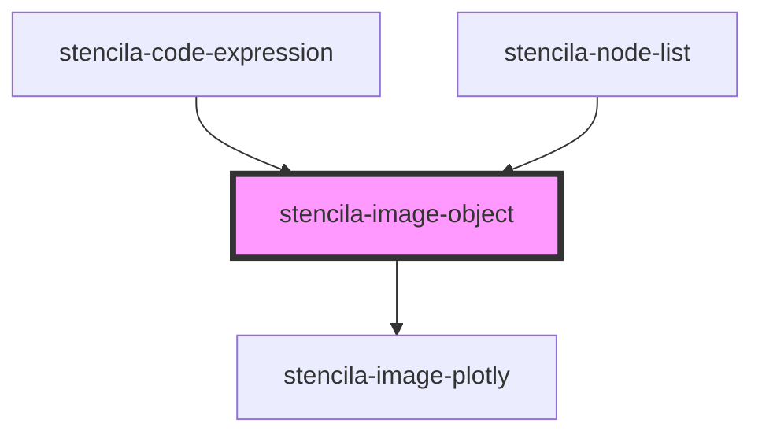

# stencila-image-object

<!-- Auto Generated Below -->

## Properties

| Property | Attribute | Description                      | Type          | Default     |
| -------- | --------- | -------------------------------- | ------------- | ----------- |
| `image`  | --        | The `ImageObject` node to render | `ImageObject` | `undefined` |

## Dependencies

### Used by

 - [stencila-code-expression](../codeExpression)
 - [stencila-node-list](../nodeList)

### Depends on

- [stencila-image-plotly](../imagePlotly)

### Graph

----------------------------------------------

*Built with [StencilJS](https://stenciljs.com/)*
