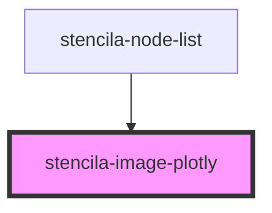

# stencila-image-plotly

<!-- Auto Generated Below -->

## Properties

| Property | Attribute | Description                                                | Type                  | Default     |
| -------- | --------- | ---------------------------------------------------------- | --------------------- | ----------- |
| `data`   | --        | The Plotly data to render as an interactive visualization. | `Data[] \| undefined` | `undefined` |

## Events

| Event          | Description                                                                            | Type               |
| -------------- | -------------------------------------------------------------------------------------- | ------------------ |
| `plotlyLoaded` | Custom event emitter to indicate that the loading of the Plotly.js script has finished | `CustomEvent<any>` |

## Dependencies

### Used by

 - [stencila-node-list](../nodeList)

### Graph

----------------------------------------------

*Built with [StencilJS](https://stenciljs.com/)*
