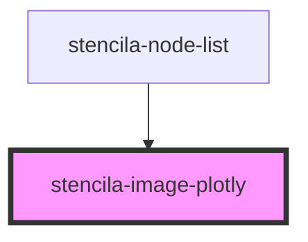

# stencila-image-plotly

<!-- Auto Generated Below -->

## Properties

| Property             | Attribute | Description                                                | Type          | Default     |
| -------------------- | --------- | ---------------------------------------------------------- | ------------- | ----------- |
| `data` _(required)_  | --        | The Plotly data to render as an interactive visualization. | `Data[]`      | `undefined` |
| `image` _(required)_ | --        | The `ImageObject` node to render as a fallback.            | `ImageObject` | `undefined` |

## Dependencies

### Used by

 - [stencila-node-list](../nodeList)

### Graph

----------------------------------------------

*Built with [StencilJS](https://stenciljs.com/)*
