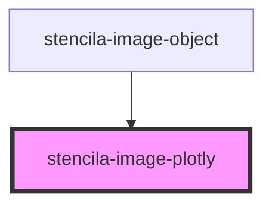

# stencila-image-plotly

<!-- Auto Generated Below -->

## Properties

| Property            | Attribute | Description           | Type         | Default     |
| ------------------- | --------- | --------------------- | ------------ | ----------- |
| `data` _(required)_ | --        | Plotly data to render | `PlotData[]` | `undefined` |

## Dependencies

### Used by

 - [stencila-image-object](../imageObject)

### Graph

----------------------------------------------

*Built with [StencilJS](https://stenciljs.com/)*
