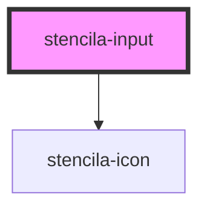

# stencila-input

<!-- Auto Generated Below -->

## Properties

| Property            | Attribute     | Description                                                                                             | Type                                                                                     | Default     |
| ------------------- | ------------- | ------------------------------------------------------------------------------------------------------- | ---------------------------------------------------------------------------------------- | ----------- |
| `autoFocus`         | `auto-focus`  | Automatically bring cursor focus to the input field on render.                                          | `boolean`                                                                                | `false`     |
| `hideLabel`         | `hide-label`  | Visually conceal the input label. Use sparingly for simple forms only with a descriptive action button. | `boolean`                                                                                | `false`     |
| `iconStart`         | `icon-start`  | Icon to show at the start of the input field.                                                           | `IconNames \| undefined`                                                                 | `undefined` |
| `inline`            | `inline`      | Render the label and input field as inline elements.                                                    | `boolean`                                                                                | `false`     |
| `inputmode`         | `inputmode`   | A hint to the browser for which keyboard to display.                                                    | `"decimal" \| "email" \| "numeric" \| "search" \| "tel" \| "text" \| "url" \| undefined` | `undefined` |
| `label`             | `label`       | Accessible text label for the input field. Defaults to the input's `name` prop.                         | `string \| undefined`                                                                    | `undefined` |
| `name` _(required)_ | `name`        | The name of the input, submitted as the value's label inside the form data.                             | `string`                                                                                 | `undefined` |
| `placeholder`       | `placeholder` | Short hint demonstrating expected input value. Shown when the input is empty.                           | `string \| undefined`                                                                    | `undefined` |
| `required`          | `required`    | When `true` value must be provided before submitting.                                                   | `boolean`                                                                                | `false`     |
| `type`              | `type`        | Type of input field.                                                                                    | `"number" \| "password" \| "search" \| "text"`                                           | `'text'`    |
| `value`             | `value`       | Text value of the input.                                                                                | `number \| string \| undefined`                                                          | `''`        |

## Dependencies

### Depends on

- [stencila-icon](../icon)

### Graph

----------------------------------------------

*Built with [StencilJS](https://stenciljs.com/)*
