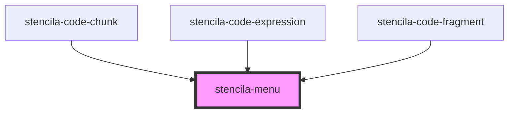

# stencila-menu

<!-- Auto Generated Below -->

## Properties

| Property       | Attribute       | Description                                                              | Type                                                                                                                                                                                                         | Default         |
| -------------- | --------------- | ------------------------------------------------------------------------ | ------------------------------------------------------------------------------------------------------------------------------------------------------------------------------------------------------------ | --------------- |
| `autoClose`    | `auto-close`    | Close the menu when losing focus                                         | `boolean`                                                                                                                                                                                                    | `true`          |
| `autoOpen`     | `auto-open`     | Open the menu on hover or when gaining focus                             | `boolean`                                                                                                                                                                                                    | `false`         |
| `isOpen`       | `is-open`       | Determines whether the Menu is shown or not                              | `boolean`                                                                                                                                                                                                    | `false`         |
| `menuPosition` | `menu-position` | The position relative to the toggle button where the menu should appear. | `"auto" \| "auto-end" \| "auto-start" \| "bottom" \| "bottom-end" \| "bottom-start" \| "left" \| "left-end" \| "left-start" \| "right" \| "right-end" \| "right-start" \| "top" \| "top-end" \| "top-start"` | `'right-start'` |

## Dependencies

### Used by

 - [stencila-code-chunk](../codeChunk)
 - [stencila-code-expression](../codeExpression)
 - [stencila-code-fragment](../codeFragment)

### Graph

----------------------------------------------

*Built with [StencilJS](https://stenciljs.com/)*
