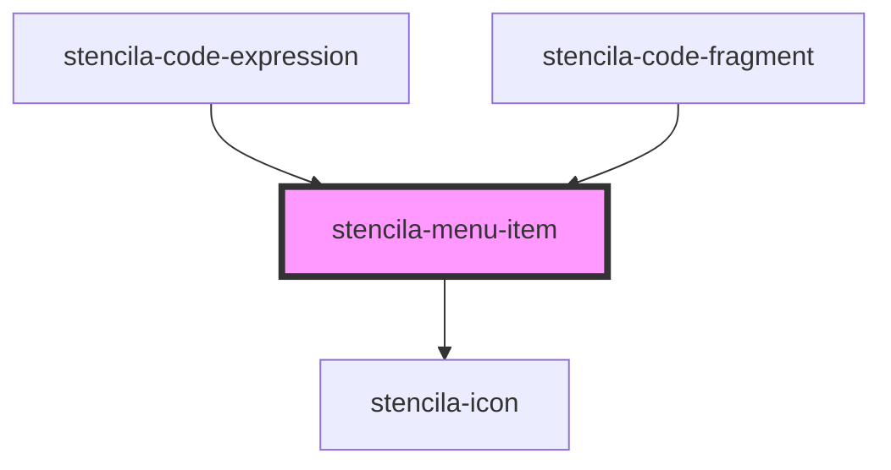

# stencila-menu-item

<!-- Auto Generated Below -->

## Properties

| Property | Attribute | Description                               | Type                                          | Default     |
| -------- | --------- | ----------------------------------------- | --------------------------------------------- | ----------- |
| `icon`   | `icon`    | Name of the icon to show before the label | `IconNames \| undefined`                      | `undefined` |
| `size`   | `size`    | The overall size of the component.        | `"default" \| "large" \| "small" \| "xsmall"` | `'default'` |

## Dependencies

### Used by

 - [stencila-code-expression](../codeExpression)
 - [stencila-code-fragment](../codeFragment)

### Depends on

- [stencila-icon](../icon)

### Graph

----------------------------------------------

*Built with [StencilJS](https://stenciljs.com/)*
