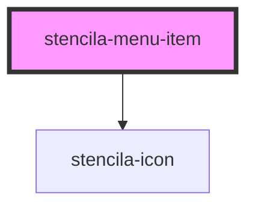

# stencila-menu-item

<!-- Auto Generated Below -->

## Properties

| Property | Attribute | Description | Type                     | Default     |
| -------- | --------- | ----------- | ------------------------ | ----------- |
| `icon`   | `icon`    |             | `IconNames \| undefined` | `undefined` |

## Dependencies

### Depends on

- [stencila-icon](../icon)

### Graph

----------------------------------------------

*Built with [StencilJS](https://stenciljs.com/)*
