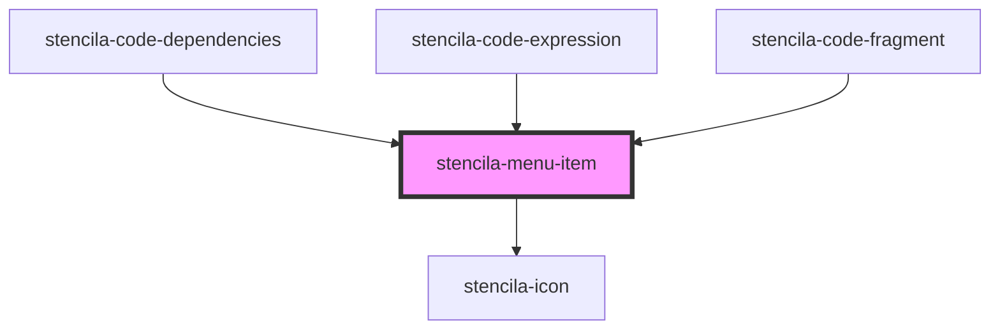

# stencila-menu-item

<!-- Auto Generated Below -->

## Properties

| Property   | Attribute  | Description                                                                              | Type                                                  | Default      |
| ---------- | ---------- | ---------------------------------------------------------------------------------------- | ----------------------------------------------------- | ------------ |
| `disabled` | `disabled` | Determines whether the menu item is enabled/clickable or not                             | `boolean`                                             | `false`      |
| `divider`  | `divider`  | Renders the menu item as a section divider. It does not have any click or hover handlers | `boolean`                                             | `false`      |
| `icon`     | `icon`     | Name of the icon to show before the label                                                | `IconNames \| undefined`                              | `undefined`  |
| `role`     | `role`     | The overall size of the component.                                                       | `"menuitem" \| "menuitemcheckbox" \| "menuitemradio"` | `'menuitem'` |
| `size`     | `size`     | The overall size of the component.                                                       | `"default" \| "large" \| "small" \| "xsmall"`         | `'default'`  |

## Dependencies

### Used by

 - [stencila-code-dependencies](../codeDependencies)
 - [stencila-code-expression](../codeExpression)
 - [stencila-code-fragment](../codeFragment)

### Depends on

- [stencila-icon](../icon)

### Graph

----------------------------------------------

*Built with [StencilJS](https://stenciljs.com/)*
