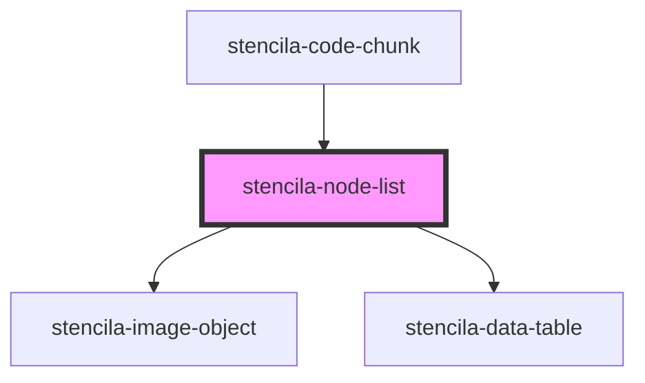

# stencila-node-list

<!-- Auto Generated Below -->

## Properties

| Property | Attribute | Description               | Type     | Default     |
| -------- | --------- | ------------------------- | -------- | ----------- |
| `nodes`  | --        | Array of nodes to render. | `Node[]` | `undefined` |

## Dependencies

### Used by

 - [stencila-code-chunk](../codeChunk)

### Depends on

- [stencila-image-object](../imageObject)
- [stencila-data-table](../dataTable)

### Graph

----------------------------------------------

*Built with [StencilJS](https://stenciljs.com/)*
