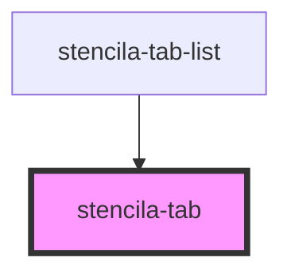

# stencila-tab

<!-- Auto Generated Below -->

## Properties

| Property     | Attribute  | Description                                     | Type      | Default     |
| ------------ | ---------- | ----------------------------------------------- | --------- | ----------- |
| `href`       | `href`     | The link the tab should navigate to             | `string`  | `'#'`       |
| `isSelected` | `selected` | Indicates whether the current tab is "selected" | `boolean` | `false`     |
| `label`      | `label`    | The displayed text of the Tab                   | `string`  | `undefined` |

## Dependencies

### Used by

- [stencila-tab-list](../tabList)

### Graph

---

_Built with [StencilJS](https://stenciljs.com/)_
