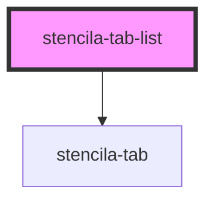

# stencila-tab-list

<!-- Auto Generated Below -->

## Properties

| Property            | Attribute | Description                                  | Type       | Default     |
| ------------------- | --------- | -------------------------------------------- | ---------- | ----------- |
| `href`              | `href`    | The link the tab should navigate to          | `string`   | `'#'`       |
| `label`             | `label`   | The displayed text of the Tab                | `string`   | `undefined` |
| `tabs` _(required)_ | --        | A list of string values to use as tab labels | `string[]` | `undefined` |

## Dependencies

### Depends on

- [stencila-tab](../tab)

### Graph

---

_Built with [StencilJS](https://stenciljs.com/)_
