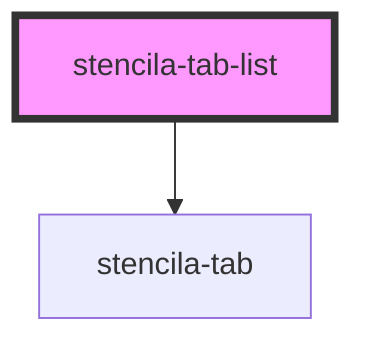

# stencila-tab-list

<!-- Auto Generated Below -->

## Properties

| Property            | Attribute | Description                                  | Type         | Default     |
| ------------------- | --------- | -------------------------------------------- | ------------ | ----------- |
| `tabs` _(required)_ | --        | A list of string values to use as tab labels | `ChildTab[]` | `undefined` |

## Dependencies

### Depends on

- [stencila-tab](../tab)

### Graph

----------------------------------------------

*Built with [StencilJS](https://stenciljs.com/)*
