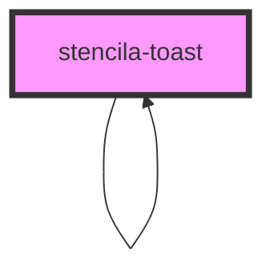

# stencila-toast

<!-- Auto Generated Below -->

## Properties

| Property   | Attribute  | Description                                                                                               | Type                                                                                                   | Default           |
| ---------- | ---------- | --------------------------------------------------------------------------------------------------------- | ------------------------------------------------------------------------------------------------------ | ----------------- |
| `duration` | `duration` | Duration in milliseconds for how long the toast should be display                                         | `number`                                                                                               | `4000`            |
| `position` | `position` | Where on the screen to show the Toast. Overrides the base position set in the `ToastController` instance. | `"bottomCenter" \| "bottomEnd" \| "bottomStart" \| "topCenter" \| "topEnd" \| "topStart" \| undefined` | `undefined`       |
| `type`     | `type`     | Type of the toast to show. Affects the component color scheme.                                            | `"danger" \| "info" \| "success" \| "warn"`                                                            | `ToastTypes.info` |

## CSS Custom Properties

| Name           | Description                             |
| -------------- | --------------------------------------- |
| `--background` | Background color of the Toast component |
| `--color`      | Text color of the Toast component       |

## Dependencies

### Used by

 - [stencila-toast](.)

### Depends on

- animate-presence
- [stencila-toast](.)

### Graph

----------------------------------------------

*Built with [StencilJS](https://stenciljs.com/)*
