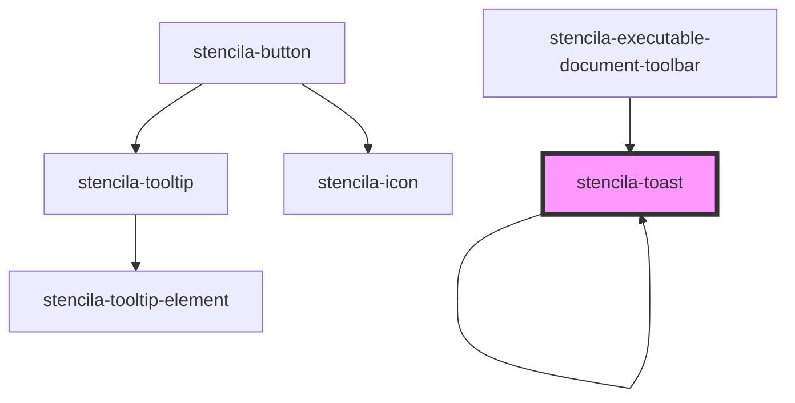

# stencila-toast

<!-- Auto Generated Below -->

## Properties

| Property      | Attribute     | Description                                                                                                                           | Type                                                                                                   | Default           |
| ------------- | ------------- | ------------------------------------------------------------------------------------------------------------------------------------- | ------------------------------------------------------------------------------------------------------ | ----------------- |
| `dismissable` | `dismissable` | If true, shows a "close" button to immediately dismiss the toast                                                                      | `boolean \| undefined`                                                                                 | `false`           |
| `duration`    | `duration`    | Duration in milliseconds for how long the toast should be display Setting `duration` to `0` will disable auto-dismissal of the toast. | `number \| undefined`                                                                                  | `4_000`           |
| `position`    | `position`    | Where on the screen to show the Toast. Overrides the base position set in the `ToastController` instance.                             | `"bottomCenter" \| "bottomEnd" \| "bottomStart" \| "topCenter" \| "topEnd" \| "topStart" \| undefined` | `undefined`       |
| `type`        | `type`        | Type of the toast to show. Affects the component colour scheme.                                                                       | `"danger" \| "info" \| "success" \| "warn"`                                                            | `ToastTypes.info` |

## CSS Custom Properties

| Name           | Description                             |
| -------------- | --------------------------------------- |
| `--background` | Background color of the Toast component |
| `--color`      | Text color of the Toast component       |

## Dependencies

### Used by

 - [stencila-executable-document-toolbar](../executableDocumentToolbar)
 - [stencila-toast](.)

### Depends on

- [stencila-icon](../icon)
- [stencila-button](../button)
- animate-presence
- [stencila-toast](.)

### Graph

----------------------------------------------

*Built with [StencilJS](https://stenciljs.com/)*
