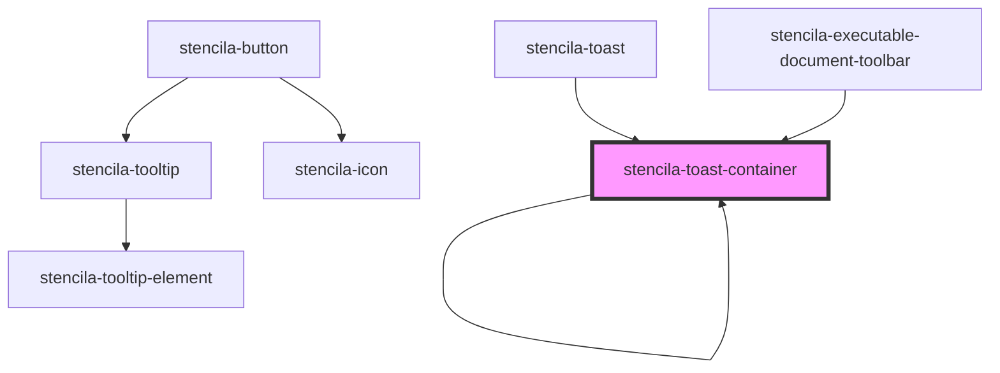

# stencila-toast-container

<!-- Auto Generated Below -->

## Properties

| Property   | Attribute  | Description                                                                                | Type                                                                                      | Default                    |
| ---------- | ---------- | ------------------------------------------------------------------------------------------ | ----------------------------------------------------------------------------------------- | -------------------------- |
| `position` | `position` | Default position of Toasts on the screen. Can be overridden by individual Toast instances. | `"bottomCenter" \| "bottomEnd" \| "bottomStart" \| "topCenter" \| "topEnd" \| "topStart"` | `ToastPositions.topCenter` |

## Dependencies

### Used by

 - [stencila-executable-document-toolbar](../executableDocumentToolbar)
 - [stencila-toast](../toast)
 - [stencila-toast-container](.)

### Depends on

- animate-presence
- [stencila-toast-container](.)
- [stencila-toast](../toast)

### Graph

----------------------------------------------

*Built with [StencilJS](https://stenciljs.com/)*
