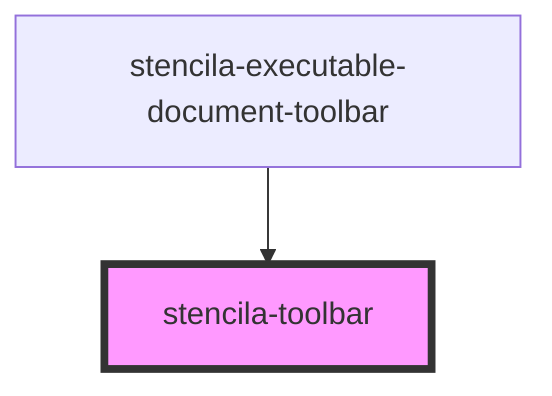

# stencila-toolbar

<!-- Auto Generated Below -->

## Properties

| Property   | Attribute  | Description                                                                                                                                                                                                             | Type                  | Default     |
| ---------- | ---------- | ----------------------------------------------------------------------------------------------------------------------------------------------------------------------------------------------------------------------- | --------------------- | ----------- |
| `color`    | `color`    | The background fill color of the Navbar                                                                                                                                                                                 | `string`              | `'primary'` |
| `position` | `position` | When `fixed` the Navbar will remain pinned to the top of the screen. Note that if the Navbar component is not followed by a sibling element, you will have to set `margin-top: 3rem` on the following element yourself. | `"fixed" \| "static"` | `'static'`  |

## CSS Custom Properties

| Name           | Description                                                                                                                                                                                                       |
| -------------- | ----------------------------------------------------------------------------------------------------------------------------------------------------------------------------------------------------------------- |
| `--background` | Sets the background color of the component. Can be a CSS variable name from the palette (`danger`, `success-300`), a fully formed CSS variable name (`--my-custom-variable`), or any other valid CSS color value. |

## Dependencies

### Used by

 - [stencila-executable-document-toolbar](../executableDocumentToolbar)

### Graph

----------------------------------------------

*Built with [StencilJS](https://stenciljs.com/)*
